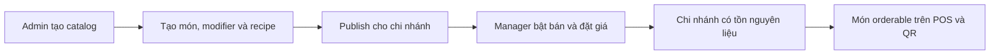
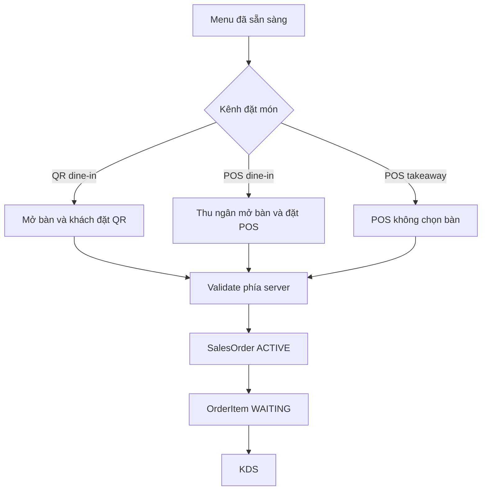
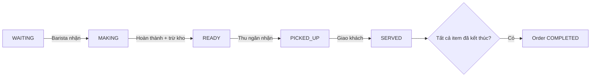
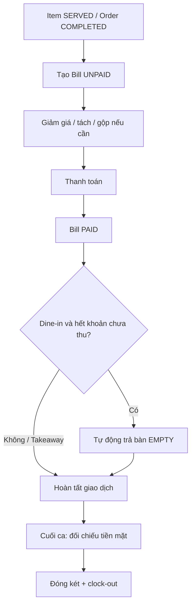

# CafeChain — Happy-case Main Flow Context

**Người yêu cầu / chủ sở hữu flow:** súc sinh  
**Nội dung:** 4 main flow happy case của hệ thống CafeChain được phân tích và lập cho súc sinh.

## 1. Mục đích

Tài liệu này mô tả bốn luồng nghiệp vụ chính của CafeChain theo đúng hành vi
hiện tại của source code. Phạm vi chỉ bao gồm **happy case**: dữ liệu hợp lệ,
người dùng đúng quyền, chi nhánh hoạt động, không có xung đột đồng thời và các
transaction hoàn tất thành công.

Các luồng lỗi như QR sai, bàn đã đóng, món hết hàng, 86, thiếu công thức,
remake, huỷ đơn, bill không hợp lệ hoặc bàn giao đơn dang dở không nằm trên
đường chính; chúng được xem là exception flow.

## 2. Actor và trách nhiệm

| Actor | Trách nhiệm chính |
|---|---|
| Admin | Quản lý chi nhánh, tài khoản, danh mục, nguyên liệu, sản phẩm, modifier, công thức và publish món |
| Branch Manager | Quản lý menu/giá tại chi nhánh, nhập và kiểm kê kho, duyệt yêu cầu 86, quản lý ca và nhân sự |
| Cashier | Bắt đầu ca, mở bàn, tạo đơn POS, theo dõi đơn, nhận/giao món, lập bill, thanh toán và chốt ca |
| Barista | Nhận món trên KDS, pha chế, hoàn thành món, sơ chế và ghi nhận sự cố/hao hụt |
| Customer | Quét QR, xem menu, đặt món tại bàn và theo dõi trạng thái món |

## 3. Quy tắc xuyên suốt

- Dữ liệu nghiệp vụ của nhân viên được giới hạn theo `BranchId`.
- Thu ngân phải ở trạng thái `ON_DUTY`, tức đã check-in và mở két, trước khi
  thực hiện thao tác ghi trong khu vực cashier.
- Đơn QR và đơn POS dùng chung `OrderService` và cùng đi vào KDS.
- Giá món và modifier được tính phía server và chụp snapshot khi tạo đơn.
- Tồn kho được thay đổi thông qua inventory ledger, không sửa trực tiếp mà
  không có transaction tham chiếu.
- Tất cả bước ghi quan trọng được xử lý trong transaction JDBC.

---

## 4. Main Flow 1 — Chuẩn bị menu và khả năng bán

### Mục tiêu

Đưa một món từ dữ liệu catalog chung thành món có thể đặt tại một chi nhánh.

### Tiền điều kiện

- Admin đã đăng nhập.
- Chi nhánh đang hoạt động.
- Dữ liệu danh mục và nguyên liệu hợp lệ.

### Happy-case sequence

1. Admin tạo chi nhánh và tài khoản nhân viên.
2. Admin tạo danh mục sản phẩm.
3. Admin tạo nguyên liệu `RAW` hoặc `PREPPED`.
4. Admin tạo sản phẩm, giá cơ bản và thời gian pha tiêu chuẩn.
5. Admin cấu hình modifier như size hoặc topping.
6. Admin khai báo công thức sản phẩm và công thức sơ chế nếu có.
7. Admin publish sản phẩm vào menu của chi nhánh.
8. Branch Manager bật bán sản phẩm và có thể cấu hình giá địa phương.
9. Chi nhánh nhập kho hoặc sơ chế để tồn nguyên liệu lớn hơn 0.
10. Hệ thống dựng menu POS/QR và đánh dấu sản phẩm `orderable=true`.

### Điều kiện orderable

Một món có thể đặt khi đồng thời thỏa mãn:

- Đã publish cho chi nhánh.
- Đang được Manager bật bán.
- Không bị 86.
- Không có nguyên liệu bắt buộc ở trạng thái `OUT`.
- Sản phẩm và modifier được chọn vẫn còn hoạt động.

`LOW` chỉ là cảnh báo và không chặn đặt món. Món Manager ngừng bán bị ẩn khỏi
menu; món `OUT` hoặc 86 có thể vẫn được hiển thị kèm lý do nhưng không thể đặt.

### Kết quả

- Món xuất hiện trên POS và menu QR của đúng chi nhánh.
- Giá hiệu lực là `LocalPrice` nếu có, nếu không dùng `BasePrice`.
- Món sẵn sàng đi vào Main Flow 2.



Source chính:

- `service/admin/ProductService.java`
- `service/admin/RecipeService.java`
- `service/shared/BranchMenuService.java`
- `service/shared/CatalogReadService.java`

---

## 5. Main Flow 2 — Nhận đơn QR và POS

### Mục tiêu

Tạo `SalesOrder ACTIVE` và các `OrderItem WAITING` từ ba kênh hợp lệ: QR
dine-in, POS dine-in và POS takeaway.

### Tiền điều kiện

- Menu chi nhánh đã sẵn sàng theo Main Flow 1.
- Với thao tác của thu ngân: thu ngân đang `ON_DUTY`.
- Với dine-in: bàn thuộc đúng chi nhánh và đang `OCCUPIED` tại thời điểm tạo đơn.

### Nhánh A — QR dine-in

1. Bàn ban đầu ở trạng thái `EMPTY`.
2. Khách quét QR gắn với bàn.
3. Hệ thống tìm thấy bàn nhưng xác định bàn chưa mở.
4. Khách gửi yêu cầu mở bàn.
5. Thu ngân nhận yêu cầu và mở bàn.
6. Bàn chuyển `EMPTY → OCCUPIED`.
7. Khách mở menu QR, chọn món, modifier và số lượng.
8. Khách gửi đơn.
9. Server kiểm tra lại bàn, menu, tồn kho, 86, giá và modifier.
10. Hệ thống tạo đơn `Source=QR`, `OrderType=DINE_IN`, `Status=ACTIVE`.
11. Hệ thống tạo các dòng món ở trạng thái `WAITING`.
12. Hệ thống ghi event `ORDER_CREATED`; đơn xuất hiện trên KDS.

### Nhánh B — POS dine-in

1. Thu ngân chọn một bàn `EMPTY` và mở bàn.
2. Bàn chuyển `EMPTY → OCCUPIED`.
3. Thu ngân mở POS cho bàn, chọn món, modifier và số lượng.
4. Server kiểm tra lại dữ liệu giống đơn QR.
5. Hệ thống tạo đơn `Source=COUNTER`, `OrderType=DINE_IN`, có `CreatedBy`.
6. Các dòng món được tạo ở trạng thái `WAITING` và đi vào KDS.

### Nhánh C — POS takeaway

1. Thu ngân mở POS nhưng không chọn bàn.
2. Thu ngân chọn món, modifier và số lượng.
3. Server nhận `tableId=null` và xác định `OrderType=TAKEAWAY`.
4. Hệ thống tạo đơn `Source=COUNTER`, `Status=ACTIVE`.
5. Các dòng món được tạo ở trạng thái `WAITING` và đi vào KDS.

Đơn takeaway **không cần mở bàn** và không làm thay đổi trạng thái bàn.

### Transaction tạo đơn

Trong cùng một transaction, hệ thống:

- Khóa và kiểm tra bàn nếu đơn có `tableId`.
- Kiểm tra sản phẩm đã publish và đang được bán.
- Kiểm tra 86 và tồn kho.
- Kiểm tra giới hạn số lượng và modifier.
- Tính giá phía server.
- Tạo `SalesOrder`, `OrderItem`, `OrderItemModifier`.
- Ghi `ORDER_CREATED` vào outbox.

### Kết quả

- Order ở trạng thái `ACTIVE`.
- Mỗi item ở trạng thái `WAITING`.
- KDS có thể nhận và xử lý đơn trong Main Flow 3.



Source chính:

- `controller/customer/QrMenuServlet.java`
- `service/customer/QrOrderService.java`
- `controller/cashier/TableServlet.java`
- `controller/cashier/PosServlet.java`
- `service/shared/OrderPlacementService.java`

---

## 6. Main Flow 3 — KDS, trừ kho và giao món

### Mục tiêu

Chuyển món từ hàng đợi pha chế đến trạng thái đã giao, đồng thời trừ tồn đúng
một lần và hoàn tất order.

### Tiền điều kiện

- Order đang `ACTIVE`.
- Item đang `WAITING`.
- Barista thuộc đúng chi nhánh và đang có quyền thao tác.
- Món có công thức hợp lệ.

### Happy-case sequence

1. Barista xem hàng đợi KDS.
2. Barista nhận món.
3. Hệ thống claim item và chuyển `WAITING → MAKING`.
4. Barista thực hiện pha chế.
5. Barista bấm hoàn thành món.
6. Hệ thống nguyên tử chuyển `MAKING → READY` cho đúng Barista đang giữ món.
7. Trong cùng transaction, hệ thống trừ nguyên liệu theo recipe và modifier.
8. Hệ thống ghi `InventoryTransaction`, activity log và event `ITEM_READY`.
9. Thu ngân nhận món khỏi quầy: `READY → PICKED_UP`.
10. Thu ngân/nhân viên giao món cho khách: `PICKED_UP → SERVED`.
11. Hệ thống kiểm tra toàn bộ item của order.
12. Nếu mọi item đều `SERVED` hoặc `CANCELLED`, order chuyển
    `ACTIVE → COMPLETED`.

### Thời điểm trừ kho

Tồn kho không bị trừ khi Barista nhận món. Điểm auto-deduct chính xác là lúc
item chuyển `MAKING → READY`. Cập nhật trạng thái và trừ kho nằm trong cùng
transaction để tránh double-deduct khi có thao tác đồng thời.

### Kết quả

- Item hoàn tất chuỗi `WAITING → MAKING → READY → PICKED_UP → SERVED`.
- Tồn kho đã giảm đúng theo recipe.
- Order chuyển `COMPLETED` khi tất cả item đã kết thúc.
- Order đủ điều kiện đi vào Main Flow 4.



Source chính:

- `controller/barista/KdsServlet.java`
- `service/shared/KdsOrderWorkflowService.java`
- `service/shared/InventoryLedgerService.java`
- `service/shared/OrderHandoffService.java`
- `service/shared/OrderRepository.java`

---

## 7. Main Flow 4 — Thanh toán, trả bàn và chốt ca

### Mục tiêu

Tạo bill, thu tiền, hoàn tất trạng thái bàn và kết thúc ca thu ngân.

### Tiền điều kiện

- Thu ngân đang `ON_DUTY` và có cashier shift đang mở.
- Các item cần thanh toán đều ở trạng thái `SERVED`.
- Bill thuộc cùng chi nhánh với ca thu ngân.

### Nhánh A — Thanh toán dine-in

1. Thu ngân chọn bàn đang `OCCUPIED`.
2. Hệ thống gom các item chưa có bill của bàn vào bill mặc định `UNPAID`.
3. Thu ngân có thể đặt giảm giá, tách bill hoặc gộp các bill chưa thu của cùng bàn.
4. Thu ngân chọn `CASH`, `QR_BANK` hoặc `TRANSFER`.
5. Hệ thống kiểm tra bill, ca thu ngân và trạng thái `SERVED` của mọi dòng bill.
6. Với tiền mặt, hệ thống tính làm tròn, tiền khách đưa và tiền thừa.
7. Bill chuyển `UNPAID → PAID` và ghi event `PAYMENT_COMPLETED`.
8. Hệ thống kiểm tra bàn còn item chưa thanh toán hay không.
9. Nếu không còn, hệ thống tự động chuyển bàn `OCCUPIED → EMPTY`.

### Nhánh B — Thanh toán takeaway

1. Khi mọi item đã kết thúc, order takeaway chuyển `COMPLETED`.
2. Thu ngân chọn order takeaway cần thanh toán.
3. Hệ thống tạo hoặc cập nhật bill `UNPAID` cho order.
4. Thu ngân chọn phương thức thanh toán.
5. Bill chuyển `UNPAID → PAID`.
6. Giao diện chuyển về lịch sử hóa đơn; không có bước trả bàn.

### Chốt ca thu ngân

1. Thu ngân xem báo cáo ca.
2. Thu ngân nhập tiền thực tế cuối ca.
3. Hệ thống tính số tiền mặt kỳ vọng bằng quỹ đầu ca cộng doanh thu `CASH`.
4. Happy case yêu cầu số tiền đóng ca khớp số tiền kỳ vọng.
5. Hệ thống đóng cashier shift.
6. Hệ thống clock-out chấm công trong cùng transaction.
7. Ca thu ngân kết thúc và báo cáo ca được lưu.

Manager không có bước phê duyệt tiền cuối ca trong happy case hiện tại.
`/manager/reconciliation` là luồng kiểm kê và điều chỉnh tồn kho, không phải
cash reconciliation.

### Kết quả

- Bill ở trạng thái `PAID`.
- Bàn dine-in tự về `EMPTY` sau bill cuối cùng.
- Doanh thu được gắn với cashier shift.
- Thu ngân đóng két và clock-out thành công.



Source chính:

- `service/cashier/BillCreationService.java`
- `service/cashier/PaymentService.java`
- `service/cashier/CashierDutyService.java`
- `service/cashier/CashierShiftService.java`
- `controller/cashier/CheckoutServlet.java`

---

## 8. End-to-end happy case

```text
Admin tạo catalog, recipe và publish món
→ Manager bật bán và chuẩn bị tồn kho
→ Thu ngân bắt đầu ca
→ Khách/thu ngân tạo đơn QR hoặc POS
→ SalesOrder ACTIVE + OrderItem WAITING
→ Barista nhận món: MAKING
→ Barista hoàn thành: READY + trừ kho
→ Thu ngân nhận món: PICKED_UP
→ Giao khách: SERVED
→ Order COMPLETED
→ Tạo Bill UNPAID
→ Thanh toán: Bill PAID
→ Dine-in tự trả bàn EMPTY
→ Thu ngân đóng két và clock-out
```

## 9. Các exception flow nằm ngoài tài liệu

- QR không hợp lệ hoặc bàn chưa được mở.
- Sản phẩm chưa publish, bị tắt bán, 86 hoặc hết nguyên liệu.
- Modifier hoặc số lượng không hợp lệ.
- Item bị `BLOCKED`, báo sự cố, remake hoặc huỷ.
- Thiếu recipe khi hoàn thành món.
- Bill có item chưa `SERVED`.
- Thanh toán không có ca thu ngân đang mở.
- Tiền mặt đóng ca không khớp.
- Kết ca khi còn đơn chưa thu và cần bàn giao cho ca sau.

## 10. Trạng thái kiểm chứng

- Unit và architecture test: `346` test, `0` failure, `0` error.
- Lệnh kiểm chứng: `mvn test`.
- Integration test SQL Server/Testcontainers không nằm trong lần kiểm chứng này.
