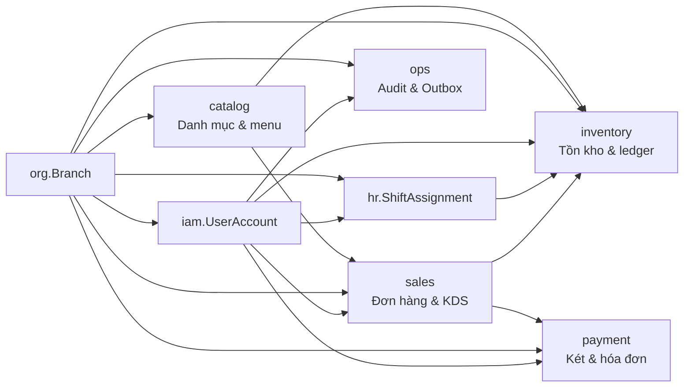
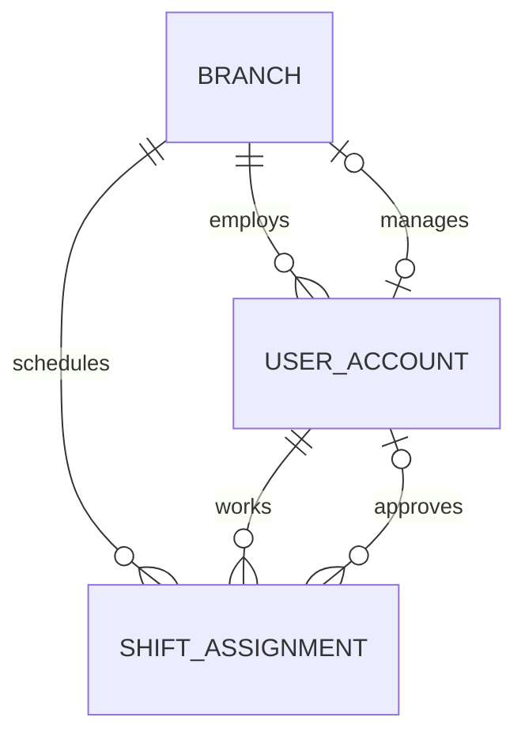
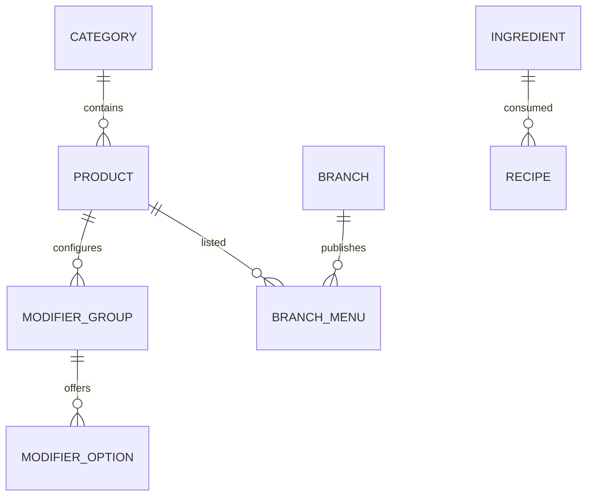
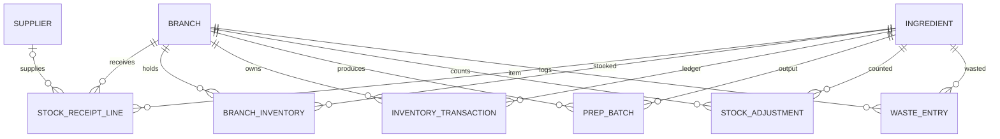
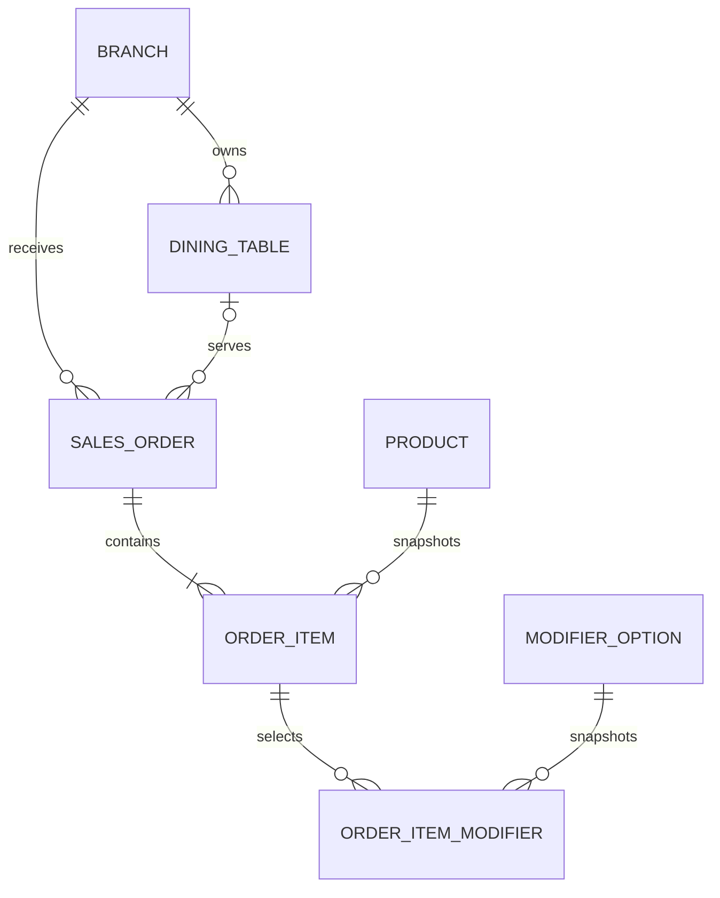
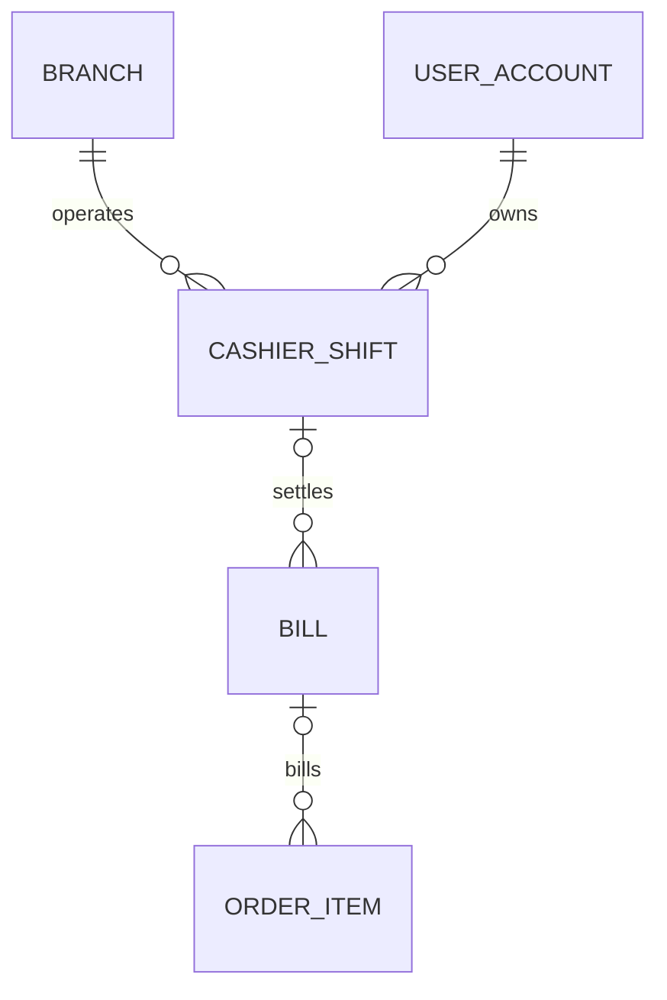

# Phân cụm nghiệp vụ và quan hệ database CafeChain

Tài liệu này mô tả schema hiện tại của `CafeChain_v2` theo các cụm nghiệp vụ để
đọc trong SSMS, tạo Database Diagram và xác định đúng bảng cần thao tác.

Phạm vi gồm 25 bảng nghiệp vụ trong 8 schema vật lý. Bảng kỹ thuật
`ops.flyway_schema_history` và `dbo.sysdiagrams` không được tính vào các cụm
nghiệp vụ.

## 1. Bức tranh tổng thể

Quan hệ điển hình là `BranchId` chạy xuyên suốt các cụm. Nhờ vậy dữ liệu của
một chi nhánh không bị nối nhầm sang chi nhánh khác; một số bảng dùng **foreign
key ghép** để bắt buộc cả thực thể và chi nhánh phải khớp.

## 2. Cụm tổ chức, tài khoản và ca làm

**Mục đích:** xác định chi nhánh, nhân sự thuộc chi nhánh và lịch/chấm công.

| Bảng | Vai trò | Khóa/quan hệ chính |
|---|---|---|
| `org.Branch` | Thông tin chi nhánh, giờ mở cửa, quản lý | PK `BranchId`; FK `ManagerUserId` → `iam.UserAccount.UserId` |
| `iam.UserAccount` | Tài khoản, vai trò, chi nhánh, lương giờ | PK `UserId`; FK tùy chọn `BranchId` → `org.Branch.BranchId` |
| `hr.ShiftAssignment` | Gộp lịch ca, phân ca, check-in/out, duyệt công | PK `ShiftAssignmentId`; FK `UserId` → user, `ApprovedBy` → manager, `BranchId` → branch |

Quan hệ:

Chi tiết vận hành:

- `RoleCode` nằm ngay trên `UserAccount`; không có bảng `Role` riêng.
- `Branch.ManagerUserId` phải trỏ tới user `BRANCH_MANAGER`, đang `ACTIVE` và
  thuộc đúng chi nhánh.
- `ShiftAssignment` lưu `WorkDate`, `StartTime`, `EndTime`, `CheckInAt`,
  `CheckOutAt` và `AttendanceStatus` (`PENDING`, `APPROVED`, `REJECTED`).
- `HourlyRateSnapshot` giữ mức lương tại thời điểm xếp ca, không phụ thuộc việc
  lương hiện tại của user thay đổi sau đó.
- `CheckInAt`/`CheckOutAt` và các timestamp khác lưu UTC; khi xem trong SSMS có
  thể dùng `DATEADD(HOUR, 7, ...)` để xem giờ Việt Nam.

## 3. Cụm catalog, công thức và menu chi nhánh

**Mục đích:** quản lý món bán, nhóm tùy chọn, nguyên liệu và việc món có xuất
hiện ở từng chi nhánh hay không.

| Bảng | Vai trò | Khóa/quan hệ chính |
|---|---|---|
| `catalog.Category` | Nhóm sản phẩm | PK `CategoryId`; 1-n tới `Product` |
| `catalog.Product` | Món bán, giá gốc, thời gian pha | PK `ProductId`; FK `CategoryId` → `Category` |
| `catalog.ModifierGroup` | Nhóm lựa chọn của món | PK `ModifierGroupId`; FK `ProductId` → `Product` |
| `catalog.ModifierOption` | Lựa chọn cụ thể, phần chênh giá | PK `ModifierOptionId`; FK `ModifierGroupId` → `ModifierGroup` |
| `catalog.Ingredient` | Nguyên liệu chuẩn và đơn vị cơ sở | PK `IngredientId`; được dùng bởi recipe và inventory |
| `catalog.Recipe` | Công thức tiêu hao | PK `RecipeId`; FK `IngredientId` → `Ingredient`; `OwnerId` là khóa đa hình |
| `catalog.BranchMenu` | Món được công bố tại chi nhánh | PK ghép `(BranchId, ProductId)`; FK tới `Branch` và `Product` |

Quan hệ:

Điểm cần hiểu khi truy vấn:

- Giá bán thực tế thường là `COALESCE(BranchMenu.LocalPrice, Product.BasePrice)`.
- `BranchMenu` còn có `IsListed`, `IsTemporarilyUnavailable`, `BackInEta`,
  `BlockReason` và quy trình duyệt chặn món.
- `Recipe.OwnerType` nhận `PRODUCT`, `PREPPED` hoặc `MODIFIER`:
  `OwnerId` lần lượt trỏ logic tới `ProductId`, `IngredientId` hoặc
  `ModifierOptionId`. Đây là quan hệ đa hình nên không thể hiện bằng một FK
  cứng duy nhất.
- Tên món, tên modifier và giá được copy thành snapshot trong `sales.OrderItem`
  và `sales.OrderItemModifier` khi tạo đơn; sửa catalog không làm đổi lịch sử.

## 4. Cụm inventory và dòng biến động tồn

**Mục đích:** theo dõi nguyên liệu theo chi nhánh, nhập hàng, sơ chế, kiểm kê và
hao hụt.

| Bảng | Vai trò | Khóa/quan hệ chính |
|---|---|---|
| `inventory.Supplier` | Nhà cung cấp | PK `SupplierId`; được tham chiếu từ phiếu nhập |
| `inventory.StockReceiptLine` | Một dòng nhập theo batch | PK `StockReceiptLineId`; FK branch, ingredient, supplier, người nhận |
| `inventory.BranchInventory` | Cache tồn hiện tại | PK ghép `(BranchId, IngredientId)`; FK branch + ingredient |
| `inventory.InventoryTransaction` | Sổ cái tăng/giảm tồn | PK `InventoryTransactionId`; FK branch, ingredient, người tạo |
| `inventory.PrepBatch` | Batch sơ chế | PK `PrepBatchId`; FK branch, ingredient PREPPED, người làm/duyệt |
| `inventory.StockAdjustment` | Kết quả kiểm kê và điều chỉnh | PK `StockAdjustmentId`; FK branch, ingredient, người kiểm kê/điều chỉnh |
| `inventory.WasteEntry` | Hao hụt nguyên liệu hoặc remake | PK `WasteEntryId`; FK branch, ingredient, product/order item/ca/user tùy loại |

Quan hệ lõi:

Luồng chuẩn:

1. Nhập hàng tạo `StockReceiptLine` và dòng `InventoryTransaction` loại
   `RECEIPT`.
2. Sơ chế tạo `PrepBatch`, đồng thời ledger có `PREP_OUT` cho nguyên liệu thô
   và `PREP_IN` cho nguyên liệu `PREPPED`.
3. Bán hàng/pha chế tiêu hao bằng ledger `DEDUCT`.
4. Kiểm kê dùng `StockAdjustment`, còn hỏng/đổ/remake dùng `WasteEntry` và
   ledger `WASTE` khi phù hợp.

`BranchInventory.QuantityOnHand` chỉ là cache đọc nhanh. Không cập nhật cột này
đơn độc bằng SSMS; mọi thay đổi phải có dòng đối ứng trong
`InventoryTransaction`, nếu không số tồn sẽ lệch sổ cái.

## 5. Cụm sales và KDS

**Mục đích:** tiếp nhận đơn, gắn bàn, theo dõi trạng thái từng món và bàn giao
cho barista/cashier.

| Bảng | Vai trò | Khóa/quan hệ chính |
|---|---|---|
| `sales.DiningTable` | Bàn và QR của chi nhánh | PK `DiningTableId`; FK `BranchId` → branch |
| `sales.SalesOrder` | Header đơn hàng | PK `OrderId`; FK branch, bàn tùy chọn, người tạo |
| `sales.OrderItem` | Các món trong đơn và snapshot giá/tên | PK `OrderItemId`; FK order, product, bill tùy chọn, các user thao tác |
| `sales.OrderItemModifier` | Modifier đã chọn trên món | PK `OrderItemModifierId`; FK order item + modifier option |

Quan hệ:

Trạng thái chính của `OrderItem` là `WAITING → MAKING → READY → PICKED_UP →
SERVED`; ngoài ra có `BLOCKED`, `REMAKE`, `CANCELLED`. Các mốc thời gian phải
phù hợp trạng thái, ví dụ `READY` phải có `StartedAt` và `DoneAt`.

`SalesOrder.BusinessDate` là ngày kinh doanh theo giờ Việt Nam, không nhất thiết
trùng ngày UTC của `CreatedAt`. `OrderItem.BranchId` được giữ như snapshot và có
FK ghép với đơn để chặn liên kết chéo chi nhánh.

## 6. Cụm payment và đối soát tiền

**Mục đích:** mở/đóng két thu ngân, gắn bill vào ca và chốt thanh toán.

| Bảng | Vai trò | Khóa/quan hệ chính |
|---|---|---|
| `payment.CashierShift` | Ca két của cashier | PK `CashierShiftId`; FK branch + cashier |
| `payment.Bill` | Tiền hàng, VAT, giảm giá, phương thức trả | PK `BillId`; FK branch + `CashierShiftId` tùy chọn |

Quan hệ:

Đặc điểm quan trọng:

- Một chi nhánh chỉ được có tối đa một `CashierShift` chưa đóng.
- `CashierShift` chỉ nhận user có `RoleCode = 'CASHIER'`, đang active và thuộc
  đúng branch.
- Một bill có thể chưa gắn ca khi còn `UNPAID`; khi thanh toán, `CashierShiftId`
  được gắn để phục vụ đối soát.
- `OrderItem.BillId` là liên kết trực tiếp tới bill; schema hiện tại không có
  bảng `BillItem` trung gian.
- Không sửa trực tiếp bill `PAID` hoặc ca đã đóng bằng SQL thủ công.

## 7. Cụm ops: audit và tích hợp bất đồng bộ

**Mục đích:** lưu dấu vết thao tác và phát sự kiện cho các consumer bên ngoài.

| Bảng | Vai trò | Khóa/quan hệ chính |
|---|---|---|
| `ops.ActivityLog` | Ai đã thay đổi entity nào, từ giá trị gì sang gì | PK `ActivityLogId`; FK tùy chọn branch + người thực hiện |
| `ops.OutboxEvent` | Sự kiện chờ đồng bộ/xử lý | PK `OutboxEventId`; FK tùy chọn `BranchId`; `Payload` là JSON |

`ActivityLog` tham chiếu entity bằng cặp `EntityType`/`EntityId`, vì vậy đây là
quan hệ audit đa hình và không có FK tới từng bảng nghiệp vụ. `OutboxEvent` cũng
giữ `AggregateId` dạng chuỗi để có thể phát nhiều loại aggregate.

## 8. Quan hệ xuyên cụm

| Từ cụm | Sang cụm | Ý nghĩa |
|---|---|---|
| `org`/`iam` | `hr` | Chi nhánh và nhân sự tạo lịch, chấm công, duyệt công |
| `catalog` | `inventory` | Ingredient/Recipe xác định nguyên liệu và công thức tiêu hao |
| `org`/`iam`/`catalog` | `inventory` | Tồn, nhập, prep, kiểm kê và hao hụt theo branch, ingredient, actor |
| `org`/`iam`/`catalog` | `sales` | Đơn thuộc branch, người tạo/pha chế thao tác, món lấy từ catalog |
| `sales` | `payment` | Bill thanh toán các `OrderItem`, ca cashier sở hữu bill |
| `hr`/`sales` | `inventory` | Hao hụt có thể gắn ca và món gây remake |
| `org`/`iam` | `ops` | Audit/outbox có thể gắn branch và người thực hiện |

## 9. Cách quan sát trong SSMS

Các file truy vấn tương ứng đã có tại [sql/ssms/README.md](../sql/ssms/README.md):

- `01_people_shifts.sql`: tổ chức, user, lịch và người đang trong ca.
- `02_catalog_menu.sql`: danh mục, món, giá chi nhánh, modifier, recipe.
- `03_inventory.sql`: tồn cache, ledger, nhập, prep, kiểm kê, hao hụt.
- `04_sales_kds.sql`: bàn, đơn, món, modifier snapshot và hàng đợi KDS.
- `05_payment.sql`: ca két, hóa đơn, doanh thu và bill chưa trả.
- `06_operations.sql`: audit log và outbox chưa xử lý.
- `00_database_map.sql`: xem bảng, FK, index, trigger và số dòng.
- `99_integrity_check.sql`: phát hiện FK lỗi, két mở trùng, lệch tồn và sai vòng đời.

Khi tạo Database Diagram trong SSMS, nên tạo diagram riêng cho từng cụm thay vì
kéo cả 25 bảng vào một sơ đồ. Điều này giữ các quan hệ nội bộ dễ đọc, còn quan hệ
xuyên cụm chỉ thêm các bảng gốc cần thiết như `Branch`, `UserAccount`, `Product`
hoặc `Ingredient`.

