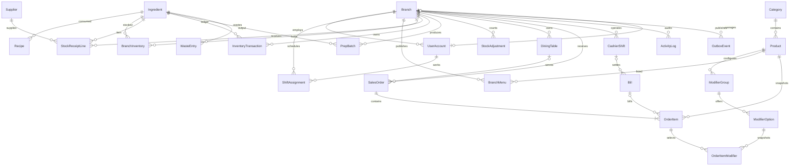

# Rà soát database CafeChain

Cập nhật: 2026-08-01 theo schema 25 bảng tại commit `f95a9ff`.

## Nguồn schema

Flyway chỉ có một file migration tạo database:

```text
src/main/resources/db/migration/V1__database.sql
```

File này chứa DDL cuối và seed demo tối thiểu. Flyway chạy migration từ
`src/main/resources/db/migration`; WAR không tự migrate khi startup mà chỉ kiểm tra
version trong `ops.flyway_schema_history`.

Các truy vấn hỗ trợ quan sát và thao tác thủ công trong SSMS nằm riêng tại
`sql/ssms`. Chúng không phải migration và không được Flyway thực thi.

Schema legacy 49 bảng và file `sql/database.sql` không còn thuộc kiến trúc hiện
tại. Không dùng danh sách bảng hoặc ERD cũ để triển khai schema mới.

## Danh sách 25 bảng

Không tính bảng kỹ thuật `ops.flyway_schema_history`.

| Schema | Số bảng | Bảng |
|---|---:|---|
| `iam` | 1 | `UserAccount` |
| `org` | 1 | `Branch` |
| `catalog` | 7 | `Category`, `Product`, `Ingredient`, `Recipe`, `ModifierGroup`, `ModifierOption`, `BranchMenu` |
| `inventory` | 7 | `Supplier`, `StockReceiptLine`, `BranchInventory`, `InventoryTransaction`, `PrepBatch`, `StockAdjustment`, `WasteEntry` |
| `hr` | 1 | `ShiftAssignment` |
| `sales` | 4 | `DiningTable`, `SalesOrder`, `OrderItem`, `OrderItemModifier` |
| `payment` | 2 | `CashierShift`, `Bill` |
| `ops` | 2 | `ActivityLog`, `OutboxEvent` |

## Thay đổi chính so với schema legacy

- Role được lưu bằng `UserAccount.RoleCode`; không còn bảng `Role`.
- `Recipe` hợp nhất công thức product/prep bằng `OwnerType` và `OwnerId`.
- `Ingredient` giữ luôn thông tin đơn vị mua và hệ số đổi sang đơn vị cơ sở.
- `ShiftAssignment` hợp nhất template ca, phân ca, check-in/out và snapshot lương.
- `StockReceiptLine` hợp nhất phiếu nhập và chi tiết theo batch.
- `StockAdjustment` hợp nhất đợt kiểm kê và dòng điều chỉnh.
- `WasteEntry` hợp nhất event, item, audit và review hao hụt.
- `OrderItem` trỏ trực tiếp đến `Bill`; không còn `BillItem`/`BillLine` trong schema.
- Nhật ký nghiệp vụ dùng `ActivityLog`; tích hợp bất đồng bộ dùng `OutboxEvent`.

## Quan hệ lõi



`Recipe.OwnerId` là khóa đa hình theo `OwnerType`, nên không được thể hiện như
một foreign key cứng tới Product hoặc Ingredient trong ERD.

## Bất biến quan trọng

- Mọi dữ liệu vận hành theo chi nhánh được giới hạn bằng `BranchId` và các
  composite foreign key khi cần.
- `BranchInventory.QuantityOnHand` là cache tồn hiện tại; biến động phải có
  dòng đối ứng trong `InventoryTransaction`.
- Số lượng sổ cái dùng đơn vị cơ sở và tối đa ba chữ số thập phân.
- `PrepTargetQty` chỉ áp dụng cho ingredient kiểu `PREPPED`.
- Mỗi chi nhánh chỉ có tối đa một `CashierShift` chưa đóng.
- Tên product, modifier và giá được snapshot trên dòng order để giữ lịch sử.
- `SalesOrder.PickupCode` unique theo chi nhánh và business date.
- Foreign key và check constraint sau migration phải enabled và trusted.
- Timestamp nghiệp vụ lưu UTC; UI chuyển sang múi giờ hiển thị.

## Deploy Flyway

- Tạo database rỗng mới; mặc định local là `CafeChain_v2`.
- Chạy profile Maven `db-migrate` với `cleanDisabled=true`,
  `outOfOrder=false`, `validateOnMigrate=true`, `baselineOnMigrate=false`.
- Không chạy `flyway clean` trên database dùng chung.
- Khi thay đổi `V1__database.sql`, database local đã migrate phải được tạo lại;
  dự án không hỗ trợ nâng cấp schema legacy tại chỗ.

Seed demo tạo `admin`, `manager1`, `cashier1`, `barista1`; mật khẩu demo là
`123456`.

## Checksum và kiểm thử

`MigrationChecksumTest` bảo đảm Flyway chỉ có một file migration SQL và checksum khớp
`sql/migration-checksums.sha256`. Nội dung được chuẩn hóa CRLF/CR thành LF
trước khi băm để kết quả giống nhau trên Windows và Linux.

Sau khi chủ đích sửa migration, cập nhật manifest bằng:

```powershell
powershell.exe -NoProfile -ExecutionPolicy Bypass `
  -File .\tools\update-migration-checksum.ps1
```

Sau đó chạy:

```powershell
mvn test
mvn clean verify -Pintegration
```

Workflow `.github/workflows/database-integration.yml` chạy suite integration trên Ubuntu
x86_64, Java 17 và SQL Server 2022 qua Testcontainers.
