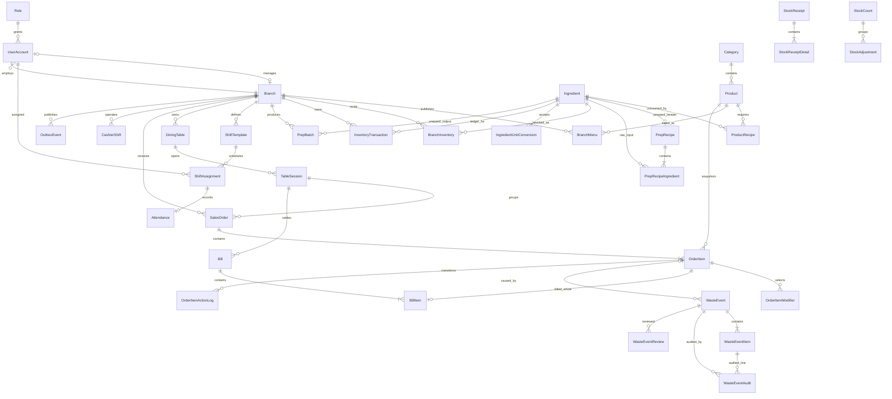

# Database CafeChain — một nguồn SQL duy nhất

Cập nhật: 2026-08-01. Toàn repository chỉ có một file database SQL:
`src/main/resources/db/migration/V1__database.sql`. File này chứa DDL cuối trực tiếp
và seed tối thiểu cho Flyway, CI và demo localhost.

## Quy ước

- 8 domain schema: `iam`, `org`, `catalog`, `inventory`, `hr`, `sales`, `payment`, `ops`.
- Bảng là danh từ số ít, `PascalCase`; không dùng từ khóa SQL làm tên vật lý.
- PK: `PK_<Table>`, cột PK: `<Entity>Id`.
- FK: `FK_<Child>_<Parent>_<Role>`.
- Unique/check/default: `UQ_`, `CK_`, `DF_<Table>_<Column>`.
- Index: `IX_<Table>_<Purpose>` hoặc `UX_<Table>_<Purpose>`.
- Tất cả timestamp nghiệp vụ lưu UTC bằng `SYSUTCDATETIME()`; UI mới đổi sang giờ Việt Nam.
- Business-name key dùng trim + uppercase + `Latin1_General_100_CI_AI`. SQL Server
  `Vietnamese_100_CI_AI` không coi `Cà phê` và `CA PHE` là cùng giá trị nên không dùng.
- `UserId` và `OrderId` là hai ngoại lệ tên khóa được giữ có chủ đích.

Metadata baseline cuối có 49 bảng dự án (50 nếu tính `ops.flyway_schema_history`). Hai archive
được giữ có chủ đích trong thời gian review/retention; sau migration drop riêng còn
47 bảng dự án như mục tiêu.

| Schema | Bảng |
|---|---|
| `iam` | `Role`, `UserAccount` |
| `org` | `Branch` |
| `catalog` | `Category`, `Product`, `Ingredient`, `IngredientUnitConversion`, `ProductRecipe`, `PrepRecipe`, `PrepRecipeIngredient`, `ModifierGroup`, `ModifierOption`, `ModifierIngredientImpact`, `ProductModifierGroup`, `BranchMenu`, `MenuBlockRequest`, `HomeSetting` |
| `inventory` | `Supplier`, `BranchInventory`, `StockReceipt`, `StockReceiptDetail`, `StockCount`, `StockAdjustment`, `InventoryTransaction`, `PrepBatch`, `WasteEvent`, `WasteEventItem`, `WasteEventAudit`, `WasteEventReview` |
| `hr` | `ShiftTemplate`, `ShiftAssignment`, `Attendance`, `Payroll` |
| `sales` | `DiningTable`, `TableSession`, `SalesOrder`, `OrderItem`, `OrderItemModifier`, `PickupSequence` |
| `payment` | `CashierShift`, `Voucher`, `Bill`, `BillItem` |
| `ops` | `OutboxEvent`, `OrderItemActionLog`, `LegacySchemaVersion`, `MenuBlockTimestampArchive`, `AttendanceDuplicateArchive`, `MigrationBackfillReport`, `flyway_schema_history` |

## ERD lõi



## Bất biến quan trọng

- `PrepRecipe` là header có đúng một `YieldQty`; detail chỉ chứa RAW ingredient.
- `ShiftAssignment`, `OrderItem`, `BillItem` giữ `BranchId` snapshot. Composite FK
  chặn quan hệ cấu trúc xuyên chi nhánh nhưng không làm hỏng lịch sử khi nhân viên chuyển nơi làm.
- Manager của branch phải là `BRANCH_MANAGER`, `ACTIVE`, thuộc đúng branch.
- Actor được trigger set-based kiểm tra role, trạng thái và branch tại thời điểm ghi.
- `InventoryTransaction.ChangeQty <> 0`; `BranchInventory.QuantityOnHand` là cache,
  ledger mới là nguồn sự thật.
- Receipt/count nhận `IngredientUnitConversionId`, chụp unit/factor tại thời điểm ghi
  và ledger chỉ ghi base quantity tối đa 3 chữ số thập phân.
- Ledger reference chỉ nhận enum uppercase và trigger xác minh nguồn tồn tại, cùng branch.
- Payroll bất biến theo `(BranchId, UserId, PayrollMonth)`; chuyển nhân viên không làm
  hỏng payroll/receipt lịch sử.
- Tên Product/Modifier trên đơn là snapshot `NOT NULL`; bill và báo cáo lịch sử không
  đọc lại tên catalog hiện tại.
- `ModifierGroup` unique toàn hệ thống. Size có giá riêng theo món nên tên vật lý là
  `Size sản phẩm #<ProductId>`; service luôn ánh xạ nhãn người dùng về `Size`.
- `PrepTargetQty` chỉ được đặt cho ingredient `PREPPED` bằng conditional typed FK.
- `SalesOrder.BusinessDate` dùng giờ Việt Nam và giờ mở cửa branch.
  `PickupSequence` cấp số bằng `UPDLOCK/HOLDLOCK` trong transaction tạo order.
- Bill splitting chỉ chuyển nguyên `OrderItem`; `UQ_BillItem_OrderItem` không cho một
  dòng món nằm trên hai bill.
- FK và CHECK sau migration đều `enabled` và `trusted`.

## Deploy Flyway

- Tạo database rỗng tên `CafeChain` bằng công cụ quản trị SQL Server.
- Migration executor riêng dùng profile Maven `db-migrate`, Flyway 13.1.0, history tại
  `ops.flyway_schema_history`; WAR không chạy migration khi startup.
- Database mới chạy migration duy nhất `V1__database.sql`; chạy lại là no-op.
- Đây là dự án demo localhost: khi đổi schema, xóa database local và dựng lại từ đầu;
  không hỗ trợ nâng cấp database legacy hoặc quy trình production nhiều release.
- Seed trong cùng file tạo chi nhánh `CN01`, ba món, tồn kho, năm bàn và bốn tài khoản
  `admin`, `manager1`, `cashier1`, `barista1`; mật khẩu demo là `123456`.
- Không có seed, preflight, fixture hoặc archive SQL rời; integration suite giữ contract
  một file SQL và kiểm tra schema cuối trực tiếp.

Production luôn bật `cleanDisabled=true`, `outOfOrder=false`, `validateOnMigrate=true`,
`baselineOnMigrate=false`. Không chạy `flyway clean` trên database dùng chung.

## Kiểm thử

```bash
mvn clean test
mvn clean verify -Pintegration
```

Integration suite kiểm fresh/no-op migration,
conversion snapshot/precision, payroll chuyển branch, order snapshot, UTC boundary,
reference/waste trigger set-based, unique-name race, startup schema guard và các flow
transaction hiện hữu.
Workflow `.github/workflows/database-integration.yml` chạy cùng suite trên Ubuntu x86_64,
Java 17 và SQL Server 2022 qua Testcontainers 1.21.4.

Nghiệm thu baseline một file ngày 2026-08-01: `336/336` unit test và
`35/35` integration test.
