# ROLE BARISTA — TOÀN TẬP

> Tài liệu tra cứu duy nhất cho vai trò **Barista (quầy pha chế)** của CafeChain: nghiệp vụ →
> thiết kế database → logic → luồng code.
>
> Phạm vi: 6 màn hình `/barista/*`, 6 servlet, 3 service riêng của role + 6 service dùng chung,
> 13 bảng DB, 9 action ghi ở KDS.
>
> Nguồn: đọc trực tiếp mã nguồn nhánh `minhnhat` tại commit **`cf92671`** (2026-08-03).
> Mọi câu SQL, tên cột, thông báo
> tiếng Việt trong tài liệu này đều trích nguyên văn từ code — nếu code đổi mà tài liệu chưa đổi
> thì **code là đúng**.

---

## MỤC LỤC

| Phần | Nội dung |
|---|---|
| [1](#1-barista-là-ai-trong-hệ-thống) | Barista là ai trong hệ thống |
| [2](#2-bản-đồ-6-màn-hình) | Bản đồ 6 màn hình (URL → Servlet → Service → DAO → View) |
| [3](#3-nghiệp-vụ-chi-tiết-từng-màn) | Nghiệp vụ chi tiết từng màn |
| [4](#4-thiết-kế-database) | Thiết kế database (bảng, cột, quan hệ, ràng buộc, index) |
| [5](#5-máy-trạng-thái-orderitem) | Máy trạng thái OrderItem — trái tim của KDS |
| [6](#6-luồng-code-chi-tiết) | Luồng code chi tiết (sequence từng use case) |
| [7](#7-quy-tắc-sổ-cái-kho) | Quy tắc sổ cái kho — 4 bất biến |
| [8](#8-bảo-mật--các-lớp-guard) | Bảo mật & các lớp guard |
| [9](#9-bẫy-và-điểm-dễ-sai) | Bẫy và điểm dễ sai |
| [10](#10-bảng-tra-cứu-file) | Bảng tra cứu file |
| [11](#11-test-đang-phủ-những-gì) | Test đang phủ những gì |
| [12](#12-từ-điển-thuật-ngữ) | Từ điển thuật ngữ |

---

# 1. Barista là ai trong hệ thống

## 1.1 Định nghĩa

Barista là **người đứng quầy pha chế**. Trong CafeChain, họ là mắt xích giữa *đơn đã đặt* và
*ly đã pha xong*:

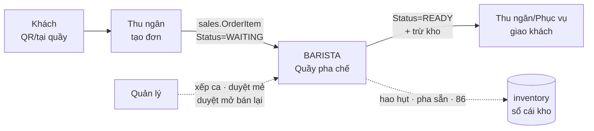

**Barista là vai trò DUY NHẤT trong hệ thống được phép trừ tồn kho theo công thức món.**
Đó là lý do mọi thao tác của họ đều đi kèm ghi sổ cái (`inventory.InventoryTransaction`) và
nhật ký (`ops.ActivityLog`).

## 1.2 Barista **được** làm gì

| Nhóm việc | Cụ thể |
|---|---|
| Pha chế | Nhận pha · hoàn thành · trả lại hàng chờ · nhận/hoàn thành cả đơn |
| Xử lý sự cố | Báo sự cố · chặn món · bỏ chặn · làm lại món · thu hồi món của người đã rời ca |
| Kho | Ghi hao hụt nguyên liệu · sửa/huỷ bản ghi của chính mình trong 15 phút · kiểm kê nhanh khi báo hết/bỏ chặn |
| Pha sẵn | Tạo mẻ PREPPED · loại bỏ mẻ quá hạn |
| Menu | Báo tạm hết món (86) · xin mở bán lại |
| Tra cứu | Xem công thức, tác động modifier, định mức pha sẵn (read-only) |
| Cá nhân | Vào ca / tan ca · xem bảng công tháng của chính mình |

## 1.3 Barista **KHÔNG** được làm gì

| Việc | Ai làm | Vì sao chặn |
|---|---|---|
| Huỷ dòng món / huỷ đơn | Thu ngân, Quản lý | `OrderIssueService.cancelItem` / `voidOrder` cố ý không expose ở màn barista — huỷ liên quan hoàn tiền. Cả hai đều huỷ được món `BLOCKED` (chưa tiêu nguyên liệu), nên món bị chặn luôn có đường thoát |
| Xoá cứng bản ghi hao hụt | Không ai | Ledger append-only; huỷ = txn bù, `Status='VOIDED'` |
| Sửa/huỷ dòng hao hụt **REMAKE** | Không ai (báo Quản lý kiểm kê) | `WasteService.getEditableWasteLog` chặn `log.isRemake()` |
| Sửa hao hụt của người khác / quá 15 phút | Quản lý (đối soát) | `getEditableWasteLog` chặn `loggedBy != userId` và `loggedAt < now-15m` |
| Duyệt mẻ pha bất thường (PENDING) | Quản lý | `PrepInventoryService.approvePrepBatch/rejectPrepBatch` |
| Mở bán lại món đã 86 | Quản lý | Barista chỉ `askReopen`; `reopen86` là API của Quản lý |
| Chấm công ở màn vận hành khác | — | `BaristaWritePolicy.isShiftAction` chỉ nhận ở `/barista/shift` |
| Thao tác chi nhánh khác | — | Mọi câu UPDATE đều `JOIN SalesOrder o ... AND o.BranchId=?` |
| Thao tác khi **ngoài ca** | — | `BaristaShiftSupport.guardWrite` / `blockedOffShift` |

## 1.4 Bộ lọc chạy trước mọi request `/barista/*`

Thứ tự khai trong [web.xml](../src/main/webapp/WEB-INF/web.xml):

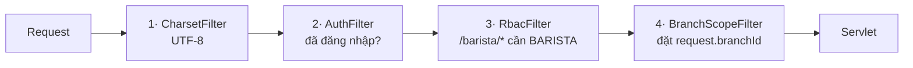

- [RbacFilter.java:44](../src/main/java/com/cafe/filter/RbacFilter.java#L44) — `/barista/` → `Constants.ROLE_BARISTA`.
  `ADMIN` đi qua mọi vùng. Sai quyền → **403**.
- [BranchContext.java:13](../src/main/java/com/cafe/web/support/BranchContext.java#L13) — thứ tự phân giải chi nhánh:
  `request attribute` → `user.branchId` → tham số `branchId` → `LOCAL_DEMO_BRANCH_ID = 1`.
- **Không có `BaristaDutyGuardFilter`.** Khác với Cashier (có `CashierDutyGuardFilter` cấp filter),
  guard trực ca của Barista nằm **trong từng servlet** qua `BaristaShiftSupport` — vì KDS cần trả
  lời AJAX bằng JSON 403 chứ không phải redirect.

---

# 2. Bản đồ 6 màn hình

| # | URL | Servlet | Service chính | View | Ghi (POST) |
|---|---|---|---|---|---|
| B1 | `/barista/kds` | [KdsServlet](../src/main/java/com/cafe/controller/barista/KdsServlet.java) | `KdsService` → `OrderQueryService` · `KdsOrderWorkflowService` · `OrderIssueService` | `barista/kds.jsp` + 3 fragment | ✅ 9 action |
| B3 | `/barista/eightysix` | [EightySixServlet](../src/main/java/com/cafe/controller/barista/EightySixServlet.java) | `BranchMenuService` | `barista/eightysix.jsp` | ✅ 2 action |
| B4 | `/barista/prep` | [PrepServlet](../src/main/java/com/cafe/controller/barista/PrepServlet.java) | `PrepService` → `InventoryService` | `barista/prep.jsp` | ✅ 2 action |
| B5 | `/barista/waste` | [WasteServlet](../src/main/java/com/cafe/controller/barista/WasteServlet.java) | `WasteService` → `InventoryService` | `barista/waste.jsp` | ✅ 3 action |
| B6 | `/barista/recipe` | [RecipeLookupServlet](../src/main/java/com/cafe/controller/barista/RecipeLookupServlet.java) | `CatalogReadService` | `barista/recipe.jsp` | ❌ read-only |
| B7 | `/barista/shift` | [MyShiftServlet](../src/main/java/com/cafe/controller/barista/MyShiftServlet.java) | `AttendanceService` | `barista/shift.jsp` | ✅ 2 action |

> Mã B1/B3/B4… là mã use case nội bộ, ghi ngay trong javadoc đầu mỗi servlet. **Không có B2** ở
> khu barista — B2 (bàn giao món) thuộc màn Pickup của Thu ngân.

## 2.1 Allowlist action — một nơi duy nhất

[BaristaWritePolicy.java](../src/main/java/com/cafe/web/support/BaristaWritePolicy.java) là **cổng
duy nhất** quyết định một `action` có được đi tiếp vào service hay không. POST tự soạn hoặc gõ sai
tên action bị chặn ngay, không âm thầm rơi vào nhánh `else` không làm gì.

| Nhóm | Action hợp lệ |
|---|---|
| `KDS` | `start`, `startOrder`, `markReady`, `markOrderReady`, `reclaim`, `returnQueue`, `reportIssue`, `unblock`, `remake` |
| `PREP` | `createBatch`, `writeOffExpired` |
| `WASTE` | `createIngredientWaste`, `update`, `void` |
| `EIGHTY_SIX` | `report86`, `askReopen` |
| `CLOCK` (chỉ B7) | `clockIn`, `clockOut` |

Action lạ → `flashError` = *"Thao tác không hợp lệ hoặc đã hết phiên. Vui lòng tải lại màn hình
rồi thử lại."* KDS AJAX nhận **HTTP 400 + header `X-Barista-Write-Denied: invalid-action`** kèm
JSON, để client hiện lỗi mà **không gửi lại form lần hai**.

## 2.2 Guard trực ca

[BaristaShiftSupport.java](../src/main/java/com/cafe/web/support/BaristaShiftSupport.java):

| Method | Dùng ở | Hành vi khi ngoài ca |
|---|---|---|
| `expose(req, path)` | **mọi** doGet | Đặt `clockStatus`, `onShift`, `clockPostUrl` → JSP ẩn nút thao tác |
| `guardWrite(req, resp, path)` | Prep · Waste · 86 | set `flashError` + `sendRedirect(path)`, trả `true` |
| `blockedOffShift(req)` | KDS | set `flashError`, trả `true` → servlet tự chọn JSON 403 (AJAX) hay redirect |
| `handleClock(req, action, path)` | chỉ B7 | Thực thi `clockIn`/`clockOut` |

Thông báo chuẩn: `OFF_SHIFT_MESSAGE` = **"Bạn đang ngoài ca — cần vào ca trước khi thao tác."**

Với KDS AJAX, phản hồi là **HTTP 403 + `X-Barista-Write-Denied: off-shift`**; JS đọc header này,
hiện thông báo rồi tự `location.assign(endpoint)` sau 700 ms
([kds-board.js:402](../src/main/webapp/assets/js/barista/kds-board.js#L402)).

---

# 3. Nghiệp vụ chi tiết từng màn

## 3.1 B1 · Quầy pha chế (KDS) — `/barista/kds`

### Triết lý thiết kế

| Quyết định | Lý do (ghi trong code) |
|---|---|
| **MỘT cột**, không phải bảng 3 cột kéo-thả | Barista đọc từ trên xuống là ra việc tiếp theo. Số thứ tự đầu dòng chính là mức khẩn cấp |
| Thống kê đếm theo **SỐ LY**, không phải số đơn | Số ly mới là khối lượng việc pha thật; số đơn chỉ là thông tin phụ |
| **Không tô đỏ theo đồng hồ** | Ở cao điểm mọi card đều "trễ" → cảnh báo lúc nào cũng bật thì nhân viên học cách phớt lờ |
| Cắt theo **ngày kinh doanh** | Món dang dở của ngày trước không lọt vào; xử lý ở màn *Đơn đến* của Thu ngân |
| **Không tự làm mới theo chu kỳ** | Barista chủ động bấm "Làm mới"; bảng tự cập nhật sau mỗi thao tác |

### Cấu trúc màn hình

```
┌─ Banner trực ca (fragments/barista/shift-banner.jsp) ─────────────────────┐
├─ Toolbar: chip [Tất cả món|Món của tôi|Chưa nhận]              │
│           details[Quầy ▾ Loại đơn ▾]  ↻ Làm mới  ● Kết nối    │
├─ (nếu cao điểm) Dải "Cao điểm · N ly đang dồn"                 │
├─ Dải 5 số liệu: Chờ pha · Đang pha · Sẵn sàng · Cần xử lý      │
│                 · Đơn đang mở (+ context)                       │
├─ Hàng chờ MỘT CỘT, 12 dòng/trang                               │
│   # | SL | Món | Bàn | Đơn | Trạng thái | [thao tác]           │
│   (đơn ≥2 dòng liền nhau → có tiêu đề nhóm + nút gộp cả đơn)   │
├─ Chân bảng: "Đang xem 1–12 / N món" + pager                     │
└─ 3 modal: Báo sự cố · Làm lại · Trả về chờ pha (kiểm kê)       │
```

### Thứ tự pha — quy tắc chính xác

Sắp xếp diễn ra **2 tầng**:

**Tầng 1 — SQL** ([OrderItemDao.findBaristaWorkbench:159](../src/main/java/com/cafe/dao/shared/OrderItemDao.java#L159)):

```sql
WHERE o.BranchId=? AND o.Status='ACTIVE'
  AND oi.Status IN ('WAITING','MAKING','READY','BLOCKED')
  AND o.CreatedAt >= @businessDayStartUtc
ORDER BY CASE WHEN oi.RemakeCount>0 THEN 0 ELSE 1 END,  -- món làm lại lên đầu
         o.CreatedAt,                                    -- FIFO theo giờ vào đơn
         oi.OrderItemId
```

> Cột `Priority` **cố ý không tham gia sắp xếp**: nó chỉ do `bump` (không còn lối vào UI) và
> `finishRemake` ghi, mà món làm lại đã được `RemakeCount` lo.

**Tầng 2 — Java** ([KdsService.sortForBrewing:136](../src/main/java/com/cafe/service/barista/KdsService.java#L136)):
món `READY` bị dồn xuống cuối — chúng chỉ còn chờ người giao, không phải việc của quầy.

Sau đó `seqNo` được đánh **1, 2, 3…** cho mọi món **chưa READY**, trên danh sách **đầy đủ** (trước
khi lọc và cắt trang) → số trên dòng là vị trí thật trong cả hàng chờ.

### Pipeline `loadBoard` — 9 bước

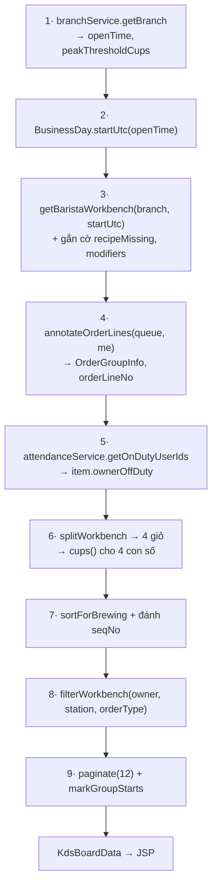

**Vì sao thứ tự này quan trọng:**

- Bước 4 chạy trên hàng chờ **đầy đủ**, TRƯỚC lọc. Nếu đếm sau lọc thì nhãn *"món 2/3"* đổi nghĩa
  mỗi lần bấm chip lọc, trong khi cái barista cần biết là đơn **thật sự** có mấy ly.
- Bước 6 (4 con số) tính trên **toàn** hàng chờ → đổi bộ lọc / lật trang không làm chúng nhảy.
- Bước 7 chạy trước bước 8 → `seqNo` là vị trí thật, không đánh lại theo từng trang.
- Bước 9 `markGroupStarts` chạy trên **đúng danh sách sắp render** (sau lọc + cắt trang).

### Bộ lọc

| Tham số | Giá trị hợp lệ | Ý nghĩa |
|---|---|---|
| `owner` | `all` · `mine` · `unassigned` | `mine` = tôi đang pha **hoặc** chính tôi vừa pha xong |
| `station` | `all` · `COFFEE` · `TEA` · `BLENDER` | Suy ra từ tên category + tên món ([OrderItem.getStation:190](../src/main/java/com/cafe/model/OrderItem.java#L190)) |
| `orderType` | `all` · `DINE_IN` · `TAKEAWAY` | Từ `sales.SalesOrder.OrderType` |
| `page` | ≥ 1 | Vượt trần → `QueuePage` kéo về biên |

Giá trị lạ → tự về `all` (`KdsBoardQuery` normalize trong compact constructor).

> **Món `BLOCKED` LUÔN được giữ lại** bất kể bộ lọc
> ([KdsService.filterWorkbench:203](../src/main/java/com/cafe/service/barista/KdsService.java#L203)):
> đó là cảnh báo an toàn, không được để bộ lọc giấu đi.

### Phân trang theo KHỐI ĐƠN

[QueuePage.splitPages:45](../src/main/java/com/cafe/service/barista/QueuePage.java#L45) — các dòng
**liền nhau cùng một đơn không bao giờ bị tách sang hai trang**.

> *Pha hết trang 1 mà đơn còn hai ly ở trang 2 là cách chắc chắn nhất để giao thiếu.*

Hệ quả: một trang có thể dài hơn 12 dòng đúng bằng phần dôi của khối cuối. Trang rỗng luôn nhận
trọn khối, kể cả khối lớn hơn cả trang — nếu không vòng lặp không bao giờ tiến.

### Cao điểm

```java
isPeak(queueCups, branchThresholdCups)
  = queueCups >= (branchThresholdCups > 0 ? branchThresholdCups : Constants.PEAK_THRESHOLD_CUPS /* 12 */)
```
`queueCups = waitingCount + makingCount` (ly, không phải đơn).

### 9 action ghi

| Action | Chuyển trạng thái | Ai được bấm | Thông báo thành công |
|---|---|---|---|
| `start` | WAITING → MAKING | Bất kỳ ai trong ca | *(không có — chỉ vẽ lại bảng)* |
| `startOrder` | N× WAITING → MAKING | Bất kỳ ai | "Đã nhận pha N món của đơn này." |
| `markReady` | MAKING → READY **+ trừ kho** | Chỉ chủ món | *(không có)* |
| `markOrderReady` | N× MAKING → READY **+ trừ kho** | Chỉ món của chính mình | "Đã hoàn thành N món của đơn này." |
| `returnQueue` | MAKING → WAITING | Chỉ chủ món | *(không có)* |
| `reclaim` | MAKING → WAITING | Người khác, **chỉ khi chủ món đã rời ca** | "Đã thu hồi món về hàng chờ — ai cũng nhận pha tiếp được." |
| `reportIssue` | 3 nhánh (xem dưới) | WAITING: ai cũng được · MAKING: chỉ chủ món | 3 câu khác nhau |
| `unblock` | BLOCKED → WAITING (± kiểm kê) | Bất kỳ ai | "Đã trả món về hàng chờ." |
| `remake` | READY/MAKING → REMAKE → WAITING **+ ghi hao hụt** | READY: ai cũng được · MAKING: chỉ chủ món | "Đã đưa món về hàng chờ với ưu tiên làm lại." |

Mọi trường hợp DAO trả `0 rows` → `flashConflict`:
**"Món vừa được cập nhật bởi thao tác khác — bảng đã làm mới."**

### `reportIssue` — 3 nhóm lý do, 3 hành động

Đây là chỗ dễ hiểu sai nhất. Nhóm nằm **trên chính enum**
([IssueReason.java](../src/main/java/com/cafe/common/IssueReason.java)), không rải ở Controller:

| Mã | Nhãn (ghi thẳng vào DB) | `isBlocking()` | Nhóm | Hành động |
|---|---|---|---|---|
| `OUT_OF_STOCK` | Hết nguyên liệu | `false` | **A** | Kiểm kê nguyên liệu **về 0 qua sổ cái** + chặn món (1 transaction) |
| `EQUIPMENT` | Máy móc gặp sự cố | `true` | **B** | Chặn món → mục "Cần xử lý" |
| `DISCONTINUED` | Món đã ngừng bán | `true` | **B** | Chặn món |
| `NOTE_UNSUPPORTED` | Không đáp ứng được ghi chú | `false` | **C** | Chỉ gắn cờ `HasIssue=1`, món **không** rời hàng chờ |
| `UNCLEAR_ORDER` | Thông tin đơn không rõ | `false` | **C** | Chỉ gắn cờ |
| `OTHER` | *(barista tự gõ — nhãn chỉ dùng cho dropdown, KHÔNG ghi vào sổ)* | `false` | **C** | Chỉ gắn cờ, lý do = text tự gõ |

> ⚠️ **Nhãn tiếng Việt là DỮ LIỆU LỊCH SỬ** — chúng được ghi thẳng vào `sales.OrderItem.IssueReason`
> và `ops.ActivityLog.Reason`. Sửa một dấu là đổi dữ liệu. Có
> [`ReasonLabelLockTest`](../src/test/java/com/cafe/common/ReasonLabelLockTest.java) khoá lại.

**Nhóm A chi tiết** ([OrderIssueService.blockItemForDepletedIngredients:65](../src/main/java/com/cafe/service/shared/OrderIssueService.java#L65)):

1. Nạp công thức của **chính món này** → tập `recipeIngredientIds`.
2. Mọi `ingredientId` barista tick **phải thuộc** tập đó, không thì ném
   *"Nguyên liệu báo hết không thuộc công thức của món này."*
   → Thiếu chốt này, một POST tự soạn ép được tồn của **bất kỳ** nguyên liệu nào ở chi nhánh về 0,
   kéo theo mọi món dùng nguyên liệu đó biến mất khỏi POS/QR.
3. **Chặn món TRƯỚC** — thua race (món vừa bị người khác xử lý) thì **không đụng tới sổ kho**.
4. Với từng nguyên liệu: `applyBaseAdjustmentInTx(qty = 0, "Barista báo hết tại quầy pha chế")`
   → sinh `inventory.StockAdjustment` + `InventoryTransaction(ADJUST)`.
5. Tồn về 0 → mọi món dùng nguyên liệu đó tự xuất hiện ở **gợi ý 86** của màn `/barista/eightysix`.

> Việc **khoá menu vẫn là thao tác có ý thức**, KHÔNG tự động: một nguyên liệu nằm trong nhiều món
> và đó là quyết định doanh thu.

### `unblock` — kiểm kê nhanh khi bỏ chặn

Hai đường:

- `recount != "1"` → `unblockItem(itemId, userId, branchId)` đơn thuần.
- `recount == "1"` → `RecountValidator.parse(ingredientId[], actualQty[])` rồi
  `unblockItem(itemId, recounts, ...)`:
  - Ô trống → bỏ qua; số **0 vẫn là một lần kiểm kê**.
  - Trùng nguyên liệu → *"Một nguyên liệu bị gửi trùng trong phiếu kiểm kê."*
  - Số âm → *"Tồn thực tế không được âm."*
  - Nguyên liệu ngoài công thức món → *"Nguyên liệu kiểm kê không thuộc công thức của món này."*
  - Trả `UnblockResult(success, remainingBlockedWithRecountedIngredients)` →
    nếu còn > 0 thì báo: *"Đã trả món về hàng chờ. Còn N món đang cần xử lý dùng nguyên liệu vừa
    kiểm lại."*

### `remake` — ghi hao hụt đúng MỘT lượt pha

Đây là chỗ tinh vi nhất của cả role. Quy tắc thuần nằm ở
[RemakeReservation.java](../src/main/java/com/cafe/common/RemakeReservation.java):

```java
reservesNextPour(fromReady, alreadyReserved) = fromReady || alreadyReserved
```

| Bỏ từ | Lượt vừa bỏ đã ghi sổ? | Dòng WASTE vừa ghi thuộc về | `RemakeInventoryReserved` sau đó | Lần bấm "Xong" kế tiếp |
|---|---|---|---|---|
| `READY` | ✅ đã DEDUCT lúc bấm Xong | lượt **kế tiếp** (giữ chỗ) | `1` | **KHÔNG** trừ nữa |
| `MAKING` (chưa từng remake) | ❌ chưa trừ gì | lượt **vừa bỏ** | `0` | Trừ bình thường |
| `MAKING` (đã `Reserved=1`) | ✅ lượt trước đã giữ chỗ | lượt **kế tiếp** | `1` | KHÔNG trừ |

> **Bất biến:** tổng lượng ghi sổ luôn bằng số lượt pha thực tế đã dùng nguyên liệu.
> Trước đây cờ được bật vô điều kiện nên làm lại từ `MAKING` bị **trừ thiếu đúng một lượt**.

Chuỗi SQL: `beginRemake`/`beginRemakeClaimed` (→ `Status='REMAKE'`, claim chuyển tiếp chống 2 người
tạo remake trùng) → `reserveRemakeForOrderItem` (ghi N dòng `WasteEntry` kind=`REMAKE`, source=`KDS`)
→ `finishRemake` (→ `WAITING`, `RemakeCount+1`, `Priority = MAX(Priority)+1`, xoá
`BaristaId/PreparedBy/StartedAt/DoneAt/HasIssue/IssueReason`).

### `reclaim` — cứu món của người đã về

Bài toán: barista tan ca mà còn món `MAKING` thì món đó **bị khoá dưới tên người đã về** — cả
`completeClaimed` lẫn `returnToQueue` đều guard theo `BaristaId`, nên ca sau không đụng được.

Hai lớp bảo vệ:

1. **Cổng tan ca** — `BaristaShiftSupport.hasPendingBrew` gọi `countMyMakingItems`; còn ly đang pha
   thì **không cho tan ca**, đẩy sang `/barista/kds?owner=mine` kèm:
   *"Bạn còn N ly đang pha — bấm "Xong" hoặc "Trả lại chờ" cho từng ly rồi mới tan ca được."*
2. **Lối gỡ tại quầy** — nếu vẫn lọt (mất máy, quên): người khác bấm **Thu hồi món**.
   Điều kiện *"đã rời ca"* được **kiểm lại ở SERVER**, không tin nút trên màn (bảng có thể đã dựng
   vài phút trước và chủ món vừa quay lại):
   - Chủ món **còn trực** → ném `BusinessException`:
     *"Người này vẫn đang trong ca — nhờ họ bấm "Trả lại chờ" cho món này."*
   - `actorUserId == baristaId` → trả `false` (món của chính mình thì dùng *Trả lại chờ*).
   - SQL guard `oi.BaristaId = @expectedBaristaId` → không thắng cuộc đua với chính chủ vừa bấm Xong.

Ghi audit: `RETURN_QUEUE` với reason = `"Thu hồi từ <tên chủ món> bởi <tên người bấm>"`.

### Hai endpoint partial (AJAX)

| Query | Trả về | Dùng cho |
|---|---|---|
| `?partial=recipe&productId=N` | `ingredient-picker.jsp` | Modal "Báo sự cố" → checkbox nguyên liệu đã hết |
| `?partial=depleted&productId=N` | `recount-picker.jsp` | Modal "Trả về chờ pha" → ô nhập tồn thật |
| `?partial=1&...` | `cards.jsp` (cả board) | Làm mới / đổi trang / sau mỗi POST |

> Nạp **theo yêu cầu** khi mở modal thay vì nhúng sẵn vào mọi card: 60 card × N nguyên liệu sẽ
> phình DOM lúc đông khách. `productId` thiếu/sai → trả fragment **rỗng** để modal hiện lời nhắc,
> không để `NumberFormatException` đội lên thành trang lỗi 500.

### Client (`kds-board.js`) — hợp đồng với server

| Cơ chế | Chi tiết |
|---|---|
| **Không auto-refresh** | Chỉ làm mới khi: bấm ↻ · sau mỗi POST · sự kiện `online` |
| Chống chồng request | `refreshing` flag + `queuedJump` — lần bấm sau cùng được xếp lại, chạy khi request đang dở kết thúc |
| Chống làm mới ngầm phá thao tác | `suppressUntil = now+1800ms` sau POST; `interactionInProgress()` (modal mở / form busy / đang gõ) |
| Giữ nguyên trang & bộ lọc | Mỗi POST tự nhét `page`, `owner`, `station`, `orderType` vào body |
| Giữ trạng thái UI | `captureViewState()` → scroll, focus, menu `<details>` đang mở |
| Bộ lọc lưu ở client | `localStorage['kdsFiltersV2']`; vào màn từ menu mà lệch → `refresh(true, 1)` đúng một lần |
| Fallback không JS | Pager là link thật; `postForm` lỗi mạng → `HTMLFormElement.prototype.submit.call(form)` |
| Mã lý do gây chặn | Server đẩy xuống qua `data-blocking-reasons` (từ `IssueReason.blockingCodesCsv()`) — **không khai lại ở JS** |

> Lưu ý kỹ thuật đã ghi trong code: dùng `form.getAttribute('action')` chứ **không** phải
> `form.action` — mọi form ở `queue-row.jsp` đều có `<input name="action">`, mà control trùng tên
> che thuộc tính cùng tên của form, khiến `fetch` dựng URL `"[object HTMLInputElement]"`.

---

## 3.2 B3 · Báo hết món (86) — `/barista/eightysix`

### "86" là gì

Tiếng lóng nhà hàng Mỹ: *"hết món, ngưng bán"*. Ở đây là bật cờ
`catalog.BranchMenu.IsTemporarilyUnavailable = 1` → món **biến mất khỏi POS và QR menu** của chi nhánh.

### Hai loại "hết món" — phân biệt rõ

| Loại | Cơ chế | Ai xử lý |
|---|---|---|
| **86 (soft)** — hết tồn | Nguyên liệu về ≤ 0 → món **tự** vào danh sách *gợi ý*, KHÔNG tự khoá | Kho tự lo. Barista chỉ nhìn gợi ý |
| **86 (hard)** — sự cố | Barista **khoá tay**, Quản lý gác mở lại | `report86` → `MenuBlockRequest` |

Gợi ý 86 (soft) — [RecipeDao.findProductsWithDepletedIngredient:152](../src/main/java/com/cafe/dao/shared/RecipeDao.java#L152):

```sql
SELECT p.ProductId, p.Name, MIN(i.Name) AS IngredientName
FROM catalog.Recipe r
JOIN catalog.Product p        ON p.ProductId = r.OwnerId
JOIN catalog.BranchMenu bm    ON bm.ProductId = p.ProductId AND bm.BranchId = ?
JOIN inventory.BranchInventory bi ON bi.IngredientId = r.IngredientId AND bi.BranchId = ?
JOIN catalog.Ingredient i     ON i.IngredientId = r.IngredientId
WHERE r.OwnerType='PRODUCT' AND bm.IsListed=1
  AND bm.IsTemporarilyUnavailable=0 AND bi.QuantityOnHand <= 0
GROUP BY p.ProductId, p.Name ORDER BY p.Name
```

### Lý do được chọn — chỉ nhóm "sự cố"

[Reason86.java](../src/main/java/com/cafe/common/Reason86.java) có 5 hằng nhưng
`selectableValues()` chỉ trả những cái `isEvent() == true`:

| Mã | Nhãn | `isEvent` | Chip bấm nhanh |
|---|---|---|---|
| `INGREDIENT_OUT` | Hết nguyên liệu | ❌ **legacy** | *(giữ để hiển thị lịch sử cũ)* |
| `SPOILED` | Hỏng / quá hạn | ❌ **legacy** | *(→ ghi ở màn Hao hụt)* |
| `EQUIPMENT` | Máy móc hỏng | ✅ | Máy pha lỗi · Máy xay lỗi · Máy đá lỗi · Tủ mát lỗi · Mất điện |
| `QUALITY` | Lỗi chất lượng | ✅ | Vị không đạt · Pha bị lỗi mẻ · Sai công thức |
| `OTHER` | Khác | ✅ | *(không có chip — buộc ghi tay ≥ 10 ký tự)* |

Chọn lý do legacy → `Menu86Validator` ném:
*"Lý do này không dùng để báo tạm hết. Hết nguyên liệu do kho tự cập nhật; đồ hỏng hãy ghi ở Hao
hụt nguyên liệu."*

> Chip **không lưu riêng vào DB** — thống kê group theo lý do là đủ, ghi chú lưu text thuần.

### Validate form (server-side, `Menu86Validator`)

Thứ tự kiểm cố định **lý do → ghi chú → thời gian** để thông báo ổn định:

1. Lý do phải thuộc `Reason86` và `isEvent()`.
2. Ghi chú chuẩn hoá **NFC** trước khi đếm — bàn phím macOS gõ tổ hợp ("ầ" = 2 code point),
   Unikey/Windows gõ dựng sẵn (1 code point); không gom về một dạng thì cùng câu lại đếm khác nhau
   tuỳ máy, và bản tổ hợp còn **tràn cột NVARCHAR**.
   - `OTHER` → tối thiểu **10 code point** (`MENU86_OTHER_NOTE_MIN_CHARS`).
   - Tối đa **255 UTF-16 unit** (`MENU86_NOTE_MAX_CHARS`, khớp `NVARCHAR(255)`; emoji ăn 2 đơn vị).
3. `backInEta` **tuỳ chọn** (sự cố thường bất định). Nếu có nhập:
   - phải ở tương lai;
   - cách hiện tại ≥ **15 phút** (`MENU86_ETA_MIN_MINUTES`);
   - không quá **7 ngày** (`MENU86_ETA_MAX_DAYS`).

> `datetime-local` mang **giờ tường VN**. Validate **trước** khi đổi sang UTC để giới hạn khớp
> đúng thứ barista nhìn thấy; lưu DB thì `BusinessDay.toUtc`.

### `request86` — một transaction, hai việc

[BranchMenuService.request86:93](../src/main/java/com/cafe/service/shared/BranchMenuService.java#L93):

```
ensurePublished(branch, product)                     -- món phải có trong menu chi nhánh
→ menuBlockDao.findOpen(...) != null ? BusinessException("Món này đang có yêu cầu chờ xử lý.")
→ menuBlockDao.insert(MenuBlockRequest{reason, note, backInEta, requestedBy})
→ dao.updateIs86(branch, product, true, etaTs)       -- phải == 1 dòng
→ outbox: MENU_86_CHANGED {productId, is86:true, eta, reason, by, requestId}
→ COMMIT
```

> Đây là **ĐƯỜNG DUY NHẤT** bật cờ 86; `reopen86` (của Quản lý) là đường duy nhất tắt.
> Cờ `IsTemporarilyUnavailable` và cụm cột `Block*` phải **luôn khớp** — nếu có đường khác hạ cờ mà
> bỏ quên yêu cầu thì barista sẽ không báo hết món đó lại được nữa. Vì vậy `save()` và
> `BranchMenuDao.upsert` **cố ý không ghi** cột này. Ràng buộc `CK_BranchMenu_BlockLifecycle` gác
> ở tầng DB.

### `askReopen`

Barista **không mở bán lại được**. Chỉ `menuBlockDao.markReopenRequested(...)` → set
`BlockReopenRequestedAt`. Thông báo: *"Đã gửi yêu cầu, chờ quản lý duyệt."*

### Phân trang

`pageSize` ∈ {10, 20, 50}, mặc định **10**. `state` ∈ {`""`, `available`, `out`}.
Redirect sau POST giữ nguyên `q`, `state`, `page`, `pageSize` (`returnUrl`).

---

## 3.3 B4 · Pha sẵn nguyên liệu — `/barista/prep`

### RAW vs PREPPED

`catalog.Ingredient.IngredientType` ∈ {`RAW`, `PREPPED`} (`CK_Ingredient_Type`).

- **RAW** — mua về dùng thẳng (sữa, đường, cà phê hạt).
- **PREPPED** — phải sơ chế (Cold Brew, si-rô tự nấu, trà ủ). Có thêm:
  - `ShelfLifeMinutes` ∈ [60, 43200] — hạn bảo quản (1 giờ … 30 ngày);
  - `PrepYieldQty` > 0 — sản lượng **một mẻ chuẩn**.

  Cả hai ràng buộc `CK_Ingredient_ShelfLife` / `CK_Ingredient_PrepYieldQty` bắt buộc chỉ
  `PREPPED` mới được có giá trị.

Công thức prep nằm cùng bảng `catalog.Recipe` với `OwnerType='PREPPED'`, `OwnerId = IngredientId`.

### Checklist "cần pha hôm nay"

[PrepChecklistRow.java](../src/main/java/com/cafe/model/PrepChecklistRow.java) — logic thuần:

```java
isOversold()   = onHand < 0                                   // phải kiểm kê, không che bằng việc pha
isNeedPrep()   = !isOversold() && targetQty != null
                 && onHand <= threshold && targetQty > onHand
isReadyToPrep()= isNeedPrep() && hasRecipe && hasShelfLife
suggestedQty() = isNeedPrep() ? targetQty - onHand : 0
```

- `threshold` = `BranchInventory.MinThreshold`
- `targetQty` = `BranchInventory.PrepTargetQty` (Quản lý đặt)

### `createBatch` — 7 lớp guard

[PrepInventoryService.createSuggestedPrepBatch:41](../src/main/java/com/cafe/service/shared/PrepInventoryService.java#L41)
+ `doCreatePrepBatch`:

| # | Guard | Thông báo khi vi phạm |
|---|---|---|
| 1 | `qtyProduced > 0` | "Sản lượng thực tế phải lớn hơn 0." |
| 2 | `clientRequestId` là UUID hợp lệ | "Phiên xác nhận mẻ không hợp lệ. Vui lòng tải lại." |
| 3 | **Idempotent** — `findByClientRequest` đã có → trả mẻ cũ, không tạo lại | *(im lặng, thành công)* |
| 4 | Ingredient còn `IsActive` và là `PREPPED` | "Nguyên liệu pha sẵn không còn khả dụng." |
| 5 | `ShelfLifeMinutes != null` | "Admin chưa đặt hạn bảo quản cho X." |
| 6 | `BranchInventory.PrepTargetQty != null` | "Manager chưa đặt mức tồn mục tiêu cho X." |
| 7 | Có công thức prep | "Có nguyên liệu pha sẵn chưa khai báo công thức prep — không thể tạo mẻ." |
| 8 | `PrepYieldQty > 0` | "Nguyên liệu pha sẵn chưa khai báo sản lượng một mẻ." |
| 9 | **Đủ tồn RAW** (đọc có khoá dòng) | "Không đủ nguyên liệu thô để pha: X: cần A / còn B đv; …" |
| 10 | `enforceWorklist`: tồn PREPPED không âm | "Tồn nguyên liệu pha sẵn đang âm — cần Manager kiểm kê trước." |
| 11 | `enforceWorklist`: tồn PREPPED ≤ ngưỡng | "Nguyên liệu đã trên ngưỡng cảnh báo — không còn cần pha lúc này." |

**Chống deadlock:** khoá dòng theo thứ tự tên RAW (`ORDER BY` của `PrepRecipeDao`) rồi mới tới
PREPPED → mọi transaction xếp hàng cùng chiều. Cùng thứ tự khoá **RAW → PREPPED** được giữ ở cả
tạo mẻ, huỷ mẻ và giảm sản lượng.

**Chống race idempotent 2 lớp:** kiểm `findByClientRequest` trước; nếu vẫn thua race thì bắt
`SQLException` mã **2601/2627** (vi phạm `UX_PrepBatch_ClientRequest`) → mở connection mới đọc lại
mẻ đã có và trả về.

### Công thức tiêu hao RAW

[PrepConsumptionCalculator.java](../src/main/java/com/cafe/common/PrepConsumptionCalculator.java):

```
consumedRaw = (qtyProduced / PrepYieldQty)  [làm tròn 6 chữ số, HALF_UP]
              × recipeLine.Quantity
```

Ví dụ: Cold Brew `PrepYieldQty = 5 L`, công thức 1 mẻ cần 400 g cà phê.
Pha 7,5 L → `7.5/5 × 400 = 600 g`.

### Mẻ bất thường — cần Quản lý duyệt

[PrepApprovalPolicy.java](../src/main/java/com/cafe/common/PrepApprovalPolicy.java):

```java
requiresApproval = qtyProduced > PrepTargetQty × 1.5
```

| | `RequiresApproval=false` (thường) | `RequiresApproval=true` (bất thường) |
|---|---|---|
| `PrepBatch.Status` | `ACTIVE` | `PENDING` |
| Ledger `PREP_OUT` (trừ RAW) | ✅ ngay | ✅ **ngay** — đã tiêu thụ vật lý |
| Ledger `PREP_IN` (cộng PREPPED) | ✅ ngay | ⏸ **hoãn** tới khi Quản lý `approve` |
| Bán được ngay? | ✅ | ❌ |
| Thông báo cho barista | "Đã xác nhận mẻ pha — tồn kho đã cập nhật." | "Đã ghi nhận nguyên liệu đã dùng — sản lượng vượt mức thông thường nên cần Manager duyệt trước khi tính vào tồn kho bán được." |

Quản lý xử lý ở `/manager/prep`:
- **Duyệt** → `Status=ACTIVE` + ghi `PREP_IN`. Chặn nếu mẻ đã quá hạn trong lúc chờ duyệt.
- **Từ chối** → `Status=REJECTED` + **hoàn RAW** (đảo `PREP_OUT`), KHÔNG đụng PREPPED (chưa từng có `PREP_IN`).

### `writeOffExpired` — loại bỏ mẻ quá hạn

Barista **chỉ bấm xác nhận, không nhập số** — không có đường ghi khống
([PrepService.writeOffExpiredBatchSuggested:58](../src/main/java/com/cafe/service/barista/PrepService.java#L58)):

```java
for (PrepBatch b : getExpiredActivePrepBatches(branchId))
    if (b.getPrepBatchId() == prepBatchId && b.isHasSuggestedWaste())
        return inventoryService.writeOffExpiredPrepBatch(branchId, prepBatchId,
                                                          b.getSuggestedWasteQuantity(), userId);
throw new BusinessException("Mẻ này không còn tồn để loại bỏ hoặc đã được xử lý. Vui lòng tải lại.");
```

**Phân bổ FIFO** ([ExpiryWasteCalculator.java](../src/main/java/com/cafe/common/ExpiryWasteCalculator.java)):
tồn ghi nhận theo **nguyên liệu**, không theo từng mẻ. Nếu mỗi mẻ tự lấy `min(sản lượng, tồn)` thì
tổng gợi ý của nhiều mẻ cùng nguyên liệu sẽ **vượt tồn thực** và làm âm kho. Vì vậy duyệt danh sách
đã sắp theo `ExpiresAt` tăng dần và trừ dần một quỹ `remainingByIngredient` chung.

Một transaction: `logWasteInTx(EXPIRED)` → `markWrittenOff(WriteOffWasteEntryId)`. Chốt nguyên tử
là điều kiện `WrittenOffAt IS NULL` trong câu UPDATE → mẻ không hiện lại ở banner để bị ghi hao hụt
chồng lên.

Reason ghi vào sổ: `"Mẻ pha sẵn #<id> quá hạn <dd/MM/yyyy HH:mm>"`.

### JSON nhúng thẳng vào `<script>` — vì sao KHÔNG dùng Jackson

`prep.jsp` có `var recipes = ${recipeJson};`. Hàm `esc()` trong `PrepService` escape thêm
`< > & '` thành `\uXXXX`:

> Một tên nguyên liệu chứa `</script>` sẽ **đóng sớm thẻ script** và biến dữ liệu thành mã chạy
> được. **Jackson mặc định KHÔNG escape mấy ký tự đó**, nên thay bằng Jackson là **hạ cấp bảo mật**.

Endpoint phụ `?stock=1` trả `{rawId: onHand}` để làm mới tồn RAW không cần reload form.

---

## 3.4 B5 · Hao hụt nguyên liệu — `/barista/waste`

### Phạm vi màn này

**CHỈ hao hụt nguyên liệu** (`EventKind = 'INGREDIENT_WASTE'`).
Dòng do làm lại món (`EventKind = 'REMAKE'`) thuộc về KDS — barista **không sửa/huỷ lẻ được**,
và đã có trong báo cáo đối soát của Quản lý.

### Phạm vi nhật ký (`WasteScope`)

[WasteService.resolveScope:74](../src/main/java/com/cafe/service/barista/WasteService.java#L74) —
ưu tiên đúng ca của người đang xem:

| Kind | Điều kiện | Khoảng thời gian |
|---|---|---|
| `OPEN_SHIFT` | Đang trong ca (`canClockOut && checkInAt != null`) | `[CheckInAt, ∞)` |
| `CLOSED_SHIFT` | Đã tan ca hôm nay | `[CheckInAt, CheckOutAt)` |
| `BUSINESS_DAY` | Không có ca nào | `[BusinessDay.startUtc(openTime), +24h)` |
| `TODAY` | `openTime == null` | `[00:00 VN, 24:00 VN)` quy về UTC |

> Cắt theo **nửa đêm lịch** thì ca đêm đang chạy bị đứt đôi lúc 00:00 và nửa đầu ca biến mất khỏi
> bảng. Dùng chung mốc `BusinessDay.startUtc` với KDS để hai màn không nói hai chuyện khác nhau về
> "hôm nay".

### Loại hao hụt × lý do — bảng khoá cứng

`WasteService.PRESETS_BY_TYPE` + `INGREDIENT_CAUSES`. Lý do **phải thuộc đúng preset** của loại đã chọn:

| `WasteType` | Preset hợp lệ | → `CauseCode` |
|---|---|---|
| `SPILL` | Đổ khi pha | `SPILL` |
| | Rơi khi thao tác | `SPILL` |
| | Sai định lượng | `WRONG_RECIPE` |
| `EXPIRED` | Hết hạn | `EXPIRED` |
| | Nguyên liệu hỏng | `EXPIRED` |
| | Bảo quản lỗi | `STORAGE` |
| | Quá thời gian mở nắp | `STORAGE` |
| `OTHER` | Mẫu thử/QC | `QC_SAMPLE` |
| | Khác | `OTHER` |

- Sai cặp → *"Dòng N: Lý do không phù hợp với loại hao hụt đã chọn."*
- Chọn "Khác" mà không ghi diễn giải → *"Dòng N: Chọn Khác thì phải nhập diễn giải."*
- Lý do lưu DB = `preset + " - " + detail` (bỏ phần rỗng).

### Ghi batch — 6 quy tắc

[WasteService.logIngredientWasteBatch:132](../src/main/java/com/cafe/service/barista/WasteService.java#L132):

1. `clientRequestId` phải khớp `[A-Za-z0-9-]{8,60}` → *"Mã gửi không hợp lệ. Vui lòng tải lại màn hình và thử lại."*
2. Tối đa **20 dòng** (`MAX_WASTE_ROWS`) → *"Mỗi lần chỉ được ghi tối đa 20 dòng hao hụt."*
3. Dòng **hoàn toàn trống** → bỏ qua (không lỗi). Dòng chạm-vào-một-ô → validate đầy đủ.
4. `ingredientId > 0`, `quantity > 0`.
5. **Gộp dòng trùng** theo khoá `(ingredientId, wasteType, causeCode, reason)` — cộng dồn `quantity`.
6. Rỗng sau khi gộp → *"Chưa có dòng hao hụt nào để ghi."*

**Chống gửi lặp 2 lớp** ([WasteInventoryService.logWasteLines:45](../src/main/java/com/cafe/service/shared/WasteInventoryService.java#L45)):
- `EventGroupId = requestId + "-" + index`; kiểm `existsGroup` trước mỗi dòng → đã có thì rollback,
  trả `0` → thông báo *"Yêu cầu này đã được ghi trước đó."*
- Chốt cuối: unique index `UX_WasteEntry_EventGroupIngredient` bắt hai POST song song.

### Ghi một dòng — `logWasteInTx` làm 5 việc

```
1· requireWasteQuantity(qty)                          -- >0, ≤ 999 999 999.999
2· biDao.isActiveConfiguredIngredient(branch, ing)    -- nguyên liệu còn hoạt động + đã cấu hình tồn
3· estimateUnitCost → snapshot đơn giá (CostBasis = SNAPSHOT | UNAVAILABLE)
4· wasteEventItemDao.insert(...)                      -- inventory.WasteEntry
5· ledgerService.applyTxn(-qty, WASTE, ref=WASTE_ENTRY:id)
6· flagNegativeStock(...)                             -- tồn xuống âm → mở review cho Quản lý
7· activityLogDao.insertWasteEntry(CREATE, null → qty)
```

**Cờ tồn âm** (`flagNegativeStock`) — mở `WasteEventReview`:

| `ReviewType` | Điều kiện |
|---|---|
| `SOFT_NEGATIVE` | `|after| ≤ |MinThreshold|` — phần âm còn trong ngưỡng cảnh báo |
| `HARD_NEGATIVE` | vượt ngưỡng — Quản lý ưu tiên xử lý trước |

### Sửa / huỷ — cửa sổ 15 phút

[WasteService.getEditableWasteLog:111](../src/main/java/com/cafe/service/barista/WasteService.java#L111)
kiểm **4 điều kiện**, ném `BusinessException` với thông báo riêng cho từng cái:

| Điều kiện | Thông báo khi vi phạm |
|---|---|
| `!log.isRemake()` | "Dòng làm lại món do KDS ghi, không sửa tại màn hao hụt." |
| `log.isEditable()` | "Bản ghi đã hết hạn sửa hoặc đã bị huỷ." |
| `log.getLoggedBy() == userId` | "Bạn chỉ được sửa bản ghi do chính mình tạo." |
| `loggedAt >= now - 15 phút` | "Bản ghi đã quá 15 phút, hãy gửi Quản lý đối soát." |

**Sửa** (`updateWaste`) — áp txn cho **phần chênh lệch**:
```
delta = newQty - oldQty
applyTxn(-delta, WASTE, ref=WASTE_ENTRY:id)     -- delta>0 ⇒ trừ thêm tồn
+ cập nhật WasteEntry (optimistic: WHERE Quantity = oldQty)
+ cập nhật CauseCode của event group
+ ActivityLog(UPDATE, oldQty → newQty)
```
Sửa **tăng** cũng có thể đẩy tồn xuống âm → `flagNegativeStock` chạy lại.

**Huỷ** (`voidWaste`) — **KHÔNG hard-delete**:
```
applyTxn(+qty, WASTE, ref=WASTE_ENTRY:id)       -- txn bù, hoàn kho
+ Status = 'VOIDED' (guard: WHERE Status='ACTIVE' — idempotent)
+ ActivityLog(VOID)
```
Thông báo: *"Đã huỷ — tồn kho hoàn lại qua sổ cái (txn bù)."*

### Prefill từ màn Prep

`GET /barista/waste?ingredientId=N&qty=X` → điền sẵn một dòng `EXPIRED` / *"Hết hạn"*.
Tham số nằm trên URL nên người dùng sửa được; giá trị rác → rơi về form trống, **không 500**.

### PRG + giữ bộ lọc

`selfUrlKeepingFilters` dựng lại URL kèm `q`, `logType`, `status`, `pageSize`, `page`.
Ghi mới → ép `page=1` (dòng vừa ghi nằm trên cùng do `LoggedAt DESC`); sửa/huỷ → giữ nguyên trang.

> Bộ lọc loại của nhật ký đi bằng tên **`logType`**, KHÔNG dùng chung `wasteType` với form ghi —
> form ghi gửi **nhiều** giá trị `wasteType` (mỗi dòng một cái), lấy nhầm là nhật ký tự lọc sai.

`pageSize` ∈ {5, 10, 20, 50}, mặc định **5** (dễ theo dõi tại quầy).

---

## 3.5 B6 · Tra cứu công thức — `/barista/recipe`

**Read-only tuyệt đối** — servlet không có `doPost`.

| Khối hiển thị | Nguồn |
|---|---|
| Danh sách món (5 dòng/trang) | `catalogReadService.getRecipeProductPage(q, categoryId, recipeState, branchId, page, 5)` |
| Công thức món | `getRecipeForProduct(productId)` — `Recipe` `OwnerType='PRODUCT'` |
| Tác động modifier | `getModifierImpactsForProduct(productId)` — `Recipe` `OwnerType='MODIFIER'` |
| Định mức pha sẵn | với mỗi nguyên liệu `PREPPED` trong công thức → `getPrepRecipe(ingredientId)` |

Bộ lọc: `q` · `categoryId` · `recipeState` ∈ {`HAS`, `NONE`} · `branchOnly` (mặc định **bật**).

`OptionImpactRow.inBaseRecipe` = nguyên liệu của modifier có nằm trong công thức gốc không.
`hasExtraIngredient` = có nguyên liệu **mới** phát sinh từ modifier → cảnh báo barista.

Bảo mật: `productId` không thuộc phạm vi bộ lọc / chi nhánh → **không tiết lộ**, chỉ hiện
*"Món được chọn không còn thuộc phạm vi tra cứu hiện tại."*

`PAGE_SIZE = 5` cố định vì danh sách nằm cạnh khung công thức, chỉ chiếm nửa màn — 5 dòng vừa hết
khung, barista không phải cuộn trong lúc pha.

---

## 3.6 B7 · Ca làm của tôi — `/barista/shift`

**Màn DUY NHẤT nhận `clockIn` / `clockOut`.**

> Vào ca là bước **có ngữ cảnh**: barista phải thấy ca được xếp rồi mới nhận quầy. Trước đây mọi
> màn đều nhận clockIn/clockOut nên thao tác đó rút gọn thành một cú bấm giữa lúc đứng máy, bỏ qua
> toàn bộ ngữ cảnh. Giới hạn này là **chốt thật phía server**, không chỉ là chuyện ẩn nút.
> — [BaristaWritePolicy.isShiftAction:39](../src/main/java/com/cafe/web/support/BaristaWritePolicy.java#L39)

### Vào ca (`clockIn`)

```
clockableAssignments(user, branch, today, grace=ZERO)   -- KHÔNG có biên trễ
  ↳ rỗng → IllegalStateException("Hôm nay bạn chưa được xếp ca.")
chooseForClockIn(...)
findByAssignmentForUpdate(...)                          -- khoá dòng, chống 2 tab
  ↳ CheckOutAt != null → "Ca này đã tan, không thể vào lại."
  ↳ CheckInAt  != null → return (idempotent)
dao.clockIn(assignmentId, currentUtc)
```

> `grace = ZERO` khi vào ca: ca đêm hôm trước chỉ tính khi **còn đang chạy**, tránh chấm nhầm vào
> ca đã qua.

### Tan ca (`clockOut`) — có cổng chặn

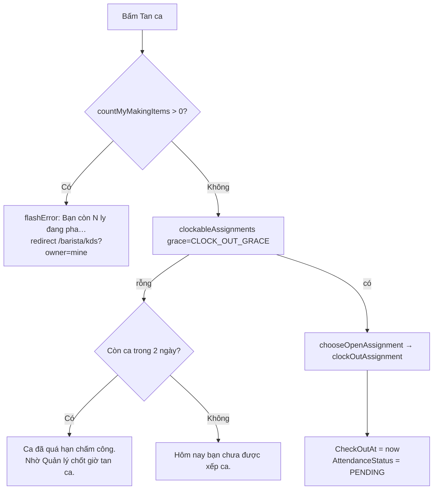

`LATE_CLOCK_OUT_LOOKBACK = 2 ngày` chỉ để **chọn đúng câu báo lỗi**, không cho phép tan ca muộn.

Tan ca xong → `AttendanceStatus = 'PENDING'` → Quản lý duyệt ở `/manager/attendance`.

### Bảng công tháng

| Attribute | Nguồn |
|---|---|
| `monthSummary` | `getMyMonthlySummary(user, branch, ym, monthRows)` — đọc **cả tháng** |
| `historyPage` | `getMyMonthlyHistoryPage(..., q, state, page, pageSize)` — chỉ lấy đúng trang từ DB |

`state` ∈ {`APPROVED`, `PENDING`, `REJECTED`, `OPEN`, `ABSENT`} — `OPEN`/`ABSENT` là trạng thái
**suy ra** từ mốc chấm công, không chỉ từ cột `AttendanceStatus`.
`pageSize` ∈ {5, 10, 20, 50}, mặc định **10**. `month` rác → về tháng hiện tại, không 500.

---

# 4. Thiết kế database

## 4.1 Tổng quan schema

Database `CafeChain_v2`, **25 bảng nghiệp vụ** trong **8 schema vật lý**. Barista chạm vào **13 bảng**:

| Schema | Bảng Barista dùng | Vai trò với Barista |
|---|---|---|
| `org` | `Branch` | Giờ mở cửa (ngày kinh doanh), ngưỡng cao điểm |
| `iam` | `UserAccount` | `RoleCode='BARISTA'`, `BranchId` |
| `hr` | `ShiftAssignment` | Ca làm, chấm công, cổng trực ca |
| `catalog` | `Product`, `Category`, `Ingredient`, `Recipe`, `ModifierOption`, `BranchMenu` | Món, công thức, cờ 86 |
| `sales` | `SalesOrder`, `OrderItem`, `OrderItemModifier`, `DiningTable` | Hàng chờ pha |
| `inventory` | `BranchInventory`, `InventoryTransaction`, `PrepBatch`, `WasteEntry`, `StockAdjustment` | Sổ cái kho |
| `ops` | `ActivityLog`, `OutboxEvent` | Audit + sự kiện |

## 4.2 ERD tổng thể của vùng Barista

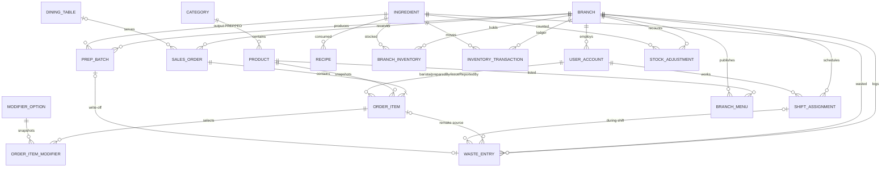

## 4.3 `sales.OrderItem` — bảng trung tâm của KDS

| Cột | Kiểu | Ai ghi (barista) | Ghi chú |
|---|---|---|---|
| `OrderItemId` | `INT IDENTITY` PK | — | |
| `OrderId` | `INT` FK→`SalesOrder` | — | `ON DELETE CASCADE` |
| `BranchId` | `INT` | — | **Snapshot**; FK ghép `(OrderId, BranchId)` chặn liên kết chéo chi nhánh |
| `ProductId` | `INT` FK→`Product` | — | |
| `ProductNameAtOrder` | `NVARCHAR(150)` | — | Snapshot — sửa catalog không đổi lịch sử |
| `Quantity` | `INT` > 0 | — | Số **ly** |
| `UnitPrice` | `DECIMAL(12,2)` ≥ 0 | — | |
| `Note` | `NVARCHAR(255)` | — | Ghi chú khách |
| **`Status`** | `VARCHAR(16)` | ✅ mọi action | 8 giá trị — xem §5 |
| `Priority` | `INT` | ✅ `finishRemake` | `MAX(Priority)+1`. **Không** tham gia ORDER BY |
| `StartedAt` | `DATETIME2` | ✅ `claim` | UTC |
| `DoneAt` | `DATETIME2` | ✅ `completeClaimed` | UTC |
| `BaristaId` | `INT` FK→`UserAccount` | ✅ | Người **đang** pha; null khi WAITING/BLOCKED |
| `PreparedBy` | `INT` FK→`UserAccount` | ✅ | Người **đã** pha xong |
| `HasIssue` | `BIT` | ✅ | Cờ sự cố |
| `IssueReason` | `NVARCHAR(255)` | ✅ | Nhãn tiếng Việt từ `IssueReason` enum |
| `IssueReportedBy` / `IssueReportedAt` | `INT` / `DATETIME2` | ✅ | |
| `RemakeCount` | `INT` ≥ 0 | ✅ `finishRemake` | > 0 ⇒ lên đầu hàng chờ |
| **`RemakeInventoryReserved`** | `BIT` | ✅ | Xem §3.1 — quyết định lần bấm Xong kế tiếp có trừ kho không |
| `PickedUpBy` / `PickedUpAt` | | ❌ Thu ngân | |
| `ServedAt` | | ❌ Thu ngân | |
| `BillId` / `BilledAmount` | | ❌ Thu ngân | `BillId != NULL` ⇒ barista/manager không huỷ được món |

**Ràng buộc quan trọng:**

```sql
CK_OrderItem_Status            Status IN ('WAITING','MAKING','READY','PICKED_UP',
                                          'SERVED','BLOCKED','CANCELLED','REMAKE')
CK_OrderItem_StatusTimestamps  (Status<>'MAKING'    OR StartedAt IS NOT NULL)
                           AND (Status<>'READY'     OR StartedAt IS NOT NULL AND DoneAt IS NOT NULL)
                           AND (Status<>'PICKED_UP' OR DoneAt IS NOT NULL AND PickedUpAt IS NOT NULL)
                           AND (Status<>'SERVED'    OR DoneAt/PickedUpAt/ServedAt IS NOT NULL)
CK_OrderItem_DoneAfterStarted  DoneAt >= StartedAt
CK_OrderItem_Quantity_Value    Quantity > 0
CK_OrderItem_NonNegative       UnitPrice >= 0 AND RemakeCount >= 0
CK_OrderItem_BillingLifecycle  (BillId IS NULL AND BilledAmount IS NULL)
                            OR (BillId IS NOT NULL AND BilledAmount IS NOT NULL)
```

> `CK_OrderItem_StatusTimestamps` là lý do `finishRemake` **phải** xoá `StartedAt`/`DoneAt` khi
> đưa món về `WAITING` — để lại thì món `WAITING` mang `DoneAt` là dữ liệu vô nghĩa.

**Khoá ghép chống chéo chi nhánh:**
```sql
UQ_OrderItem_IdBranch           (OrderItemId, BranchId)
UQ_OrderItem_IdProductBranch    (OrderItemId, ProductId, BranchId)
FK_OrderItem_SalesOrder_Branch  (OrderId, BranchId) → SalesOrder(OrderId, BranchId)
FK_WasteEntry_OrderItem_ProductBranch (OrderItemId, ProductId, BranchId) → OrderItem(...)
```

**Index phục vụ KDS:**
```sql
IX_OrderItem_BaristaStatus  (BaristaId, Status)      -- countMakingByBarista, "món của tôi"
IX_OrderItem_Status         (Status)
IX_OrderItem_OrderBranch    (OrderId, BranchId)      -- findByOrder
IX_OrderItem_BranchOrder    (BranchId, OrderId)
IX_OrderItem_PreparedDone   (PreparedBy, DoneAt) INCLUDE (OrderId, Quantity, StartedAt, Status)
```

## 4.4 `sales.SalesOrder`

| Cột | Kiểu | Ý nghĩa với Barista |
|---|---|---|
| `Status` | `VARCHAR(12)` | **Mọi** guard SQL đều yêu cầu `= 'ACTIVE'` |
| `CreatedAt` | `DATETIME2` (UTC) | Trục FIFO của hàng chờ **và** mốc cắt ngày kinh doanh |
| `OrderType` | `VARCHAR(16)` | `DINE_IN` / `TAKEAWAY` — bộ lọc |
| `PickupCode` | `VARCHAR(8)` | Mã gọi món; unique theo `(BranchId, BusinessDate, PickupCode)` |
| `BusinessDate` | `DATE` | Ngày kinh doanh VN — **không** nhất thiết trùng ngày UTC của `CreatedAt` |
| `DiningTableId` | `INT` NULL | → `DiningTable.TableNumber` hiện ở cột "Bàn" |

## 4.5 `catalog.Recipe` — quan hệ đa hình

```sql
CREATE TABLE catalog.Recipe (
    RecipeId     INT IDENTITY PK,
    OwnerType    VARCHAR(8)  NOT NULL,   -- 'PRODUCT' | 'PREPPED' | 'MODIFIER'
    OwnerId      INT         NOT NULL,   -- ↓ trỏ logic, KHÔNG có FK cứng
    IngredientId INT         NOT NULL FK → catalog.Ingredient,
    Quantity     DECIMAL(12,3) NOT NULL,
    CONSTRAINT UQ_Recipe_OwnerIngredient UNIQUE (OwnerType, OwnerId, IngredientId)
);
```

| `OwnerType` | `OwnerId` trỏ tới | Barista dùng ở |
|---|---|---|
| `PRODUCT` | `catalog.Product.ProductId` | Trừ kho lúc `markReady`; kiểm nguyên liệu hợp lệ khi báo hết / kiểm kê |
| `PREPPED` | `catalog.Ingredient.IngredientId` | Tính RAW tiêu hao khi tạo mẻ |
| `MODIFIER` | `catalog.ModifierOption.ModifierOptionId` | Cộng/trừ định lượng theo tuỳ chọn khách |

> Đây là quan hệ **đa hình** nên không thể hiện bằng một FK cứng duy nhất. Đó cũng là lý do
> `findProductsWithDepletedIngredient` phải viết `JOIN catalog.Product p ON p.ProductId = r.OwnerId`
> **kèm** `WHERE r.OwnerType='PRODUCT'`.

## 4.6 `catalog.Ingredient`

| Cột | Ràng buộc |
|---|---|
| `IngredientType` | `CK_Ingredient_Type`: `'RAW'` \| `'PREPPED'` |
| `ShelfLifeMinutes` | `CK_Ingredient_ShelfLife`: RAW ⇒ NULL; PREPPED ⇒ NULL hoặc **[60, 43200]** |
| `PrepYieldQty` | `CK_Ingredient_PrepYieldQty`: NULL hoặc (PREPPED **và** > 0) |
| `PurchaseUnitName` / `PurchaseFactorToBase` | `CK_Ingredient_PurchaseUnit`: cùng NULL hoặc cùng NOT NULL, factor > 0 |
| `UQ_Ingredient_IdType` | `(IngredientId, IngredientType)` — **để FK ghép ép kiểu** |

`UQ_Ingredient_IdType` là mấu chốt của hai FK "ép kiểu" rất đáng chú ý:

```sql
-- PrepBatch chỉ được trỏ vào nguyên liệu PREPPED — ép ở tầng DB, không phải ở code
PreppedTypeGuard AS CONVERT(VARCHAR(10),'PREPPED') PERSISTED
FK_PrepBatch_Ingredient_PreppedTyped (PreppedIngredientId, PreppedTypeGuard)
    → catalog.Ingredient(IngredientId, IngredientType)

-- BranchInventory chỉ được đặt PrepTargetQty cho nguyên liệu PREPPED
PrepTargetTypeGuard AS (CASE WHEN PrepTargetQty IS NULL THEN NULL ELSE 'PREPPED' END) PERSISTED
FK_BranchInventory_Ingredient_PrepTargetTyped (IngredientId, PrepTargetTypeGuard)
    → catalog.Ingredient(IngredientId, IngredientType)
```

## 4.7 `catalog.BranchMenu` — cờ 86

| Cột | Ý nghĩa |
|---|---|
| PK ghép `(BranchId, ProductId)` | |
| `IsListed` | Món có trong menu chi nhánh |
| `LocalPrice` | Giá riêng; giá bán = `COALESCE(LocalPrice, Product.BasePrice)` |
| **`IsTemporarilyUnavailable`** | **Cờ 86** — 1 ⇒ ẩn khỏi POS + QR |
| `BackInEta` | Dự kiến có lại (UTC), có thể NULL |
| `BlockReason` | Mã `Reason86` |
| `BlockNote` | Ghi chú (≤ 255) |
| `BlockRequestedBy` / `BlockRequestedAt` | Barista báo |
| `BlockReopenRequestedAt` | Barista xin mở lại (`askReopen`) |
| `BlockStatus` | `PENDING` \| `APPROVED` |
| `BlockReviewedBy` / `BlockReviewedAt` / `BlockReviewNote` | Quản lý duyệt |

`CK_BranchMenu_BlockLifecycle` — ba hình dạng hợp lệ **duy nhất**:

| | `BlockStatus` | `BlockReason`/`RequestedBy`/`RequestedAt` | `BlockReviewedBy`/`ReviewedAt` |
|---|---|---|---|
| Chưa chặn | `NULL` | tất cả NULL | NULL |
| Chờ duyệt | `'PENDING'` | NOT NULL | **NULL** |
| Đã duyệt | `'APPROVED'` | NOT NULL | NOT NULL |

`CK_BranchMenu_BlockTimeOrder`: `BackInEta ≥ BlockRequestedAt`, `BlockReopenRequestedAt ≥ BlockRequestedAt`,
`BlockReviewedAt ≥ BlockRequestedAt`.

## 4.8 `inventory.BranchInventory` — cache tồn

| Cột | Ghi chú |
|---|---|
| PK ghép `(BranchId, IngredientId)` | |
| `QuantityOnHand` | `DECIMAL(12,3)` — **CHỈ LÀ CACHE ĐỌC NHANH** |
| `MinThreshold` | Ngưỡng cảnh báo; cũng là ngưỡng "cần pha" của checklist |
| `PrepTargetQty` | Mức tồn mục tiêu PREPPED (Quản lý đặt); null ⇒ không tạo mẻ được |
| `UpdatedAt` | |

> ⚠️ **KHÔNG bao giờ `UPDATE QuantityOnHand` đơn độc bằng SSMS.** Mọi thay đổi phải có dòng đối
> ứng trong `InventoryTransaction`, nếu không số tồn sẽ lệch sổ cái và
> [`CriticalIntegrityIT`](../src/test/java/com/cafe/integration/CriticalIntegrityIT.java) sẽ bắt.

## 4.9 `inventory.InventoryTransaction` — sổ cái append-only

```sql
InventoryTransactionId BIGINT IDENTITY PK
BranchId, IngredientId   INT      FK
ChangeQty                DECIMAL(12,3)   -- CK: <> 0 (âm = trừ, dương = cộng)
TxnType                  VARCHAR(12)
ReferenceType            VARCHAR(40) NULL
ReferenceId              VARCHAR(64) NULL
CreatedBy                INT NULL FK
CreatedAt                DATETIME2
```

| `TxnType` | Sinh ra khi | Barista gây ra? |
|---|---|---|
| `RECEIPT` | Nhập hàng | ❌ Quản lý |
| `DEDUCT` | **`markReady`** — trừ theo công thức | ✅ |
| `PREP_OUT` | Tạo mẻ pha sẵn — trừ RAW | ✅ |
| `PREP_IN` | Mẻ có hiệu lực — cộng PREPPED | ✅ (gián tiếp) |
| `WASTE` | Ghi/sửa/huỷ hao hụt, remake, write-off | ✅ |
| `ADJUST` | Kiểm kê / điều chỉnh | ✅ (báo hết, kiểm kê nhanh) |

`CK_InventoryTransaction_Reference` bắt buộc `ReferenceType` ∈
{`STOCK_RECEIPT_LINE`, `STOCK_ADJUSTMENT`, `WASTE_ENTRY`, `PREP_BATCH`, `ORDER_ITEM`} và
`ReferenceId` phải parse được thành `BIGINT` (trừ `STOCK_RECEIPT_LINE`).

**Vì sao quan trọng:** huỷ mẻ / huỷ hao hụt **đọc lại chính sổ cái** theo `(ReferenceType, ReferenceId)`
chứ không tính lại theo công thức — định mức có thể đã đổi từ lúc ghi, và số đã bị làm tròn về
`DECIMAL(12,3)`. Nhờ vậy ledger **nets về đúng 0** theo từng `TxnType`.

## 4.10 `inventory.PrepBatch`

| Cột | Ghi chú |
|---|---|
| `PreppedIngredientId` | FK ghép ép kiểu `PREPPED` (§4.6) |
| `QuantityProduced` | `CK > 0` |
| `MadeBy` / `MadeAt` | Barista + UTC |
| `ExpiresAt` | `MadeAt + ShelfLifeMinutes` |
| `Status` | `ACTIVE` \| `PENDING` \| `REJECTED` \| `CANCELLED` |
| `RequiresApproval` | `qtyProduced > PrepTargetQty × 1.5` |
| `ReviewedBy` / `ReviewedAt` | Quản lý |
| `VoidedAt` | Khi `CANCELLED` |
| `WrittenOffAt` / `WriteOffWasteEntryId` | Khi ghi hao hụt quá hạn — **cùng NULL hoặc cùng NOT NULL** |
| `ClientRequestId` | `VARCHAR(36)` UUID — idempotent |

`CK_PrepBatch_Lifecycle` (rút gọn):
```
(ReviewedBy, ReviewedAt) cùng NULL hoặc cùng NOT NULL
ExpiresAt >= MadeAt
Status='PENDING'   ⇒ RequiresApproval=1 AND ReviewedBy IS NULL
Status='REJECTED'  ⇒ RequiresApproval=1 AND ReviewedBy IS NOT NULL
Status='ACTIVE'    ⇒ RequiresApproval=0 OR ReviewedBy IS NOT NULL
Status='CANCELLED' ⇒ VoidedAt IS NOT NULL
(WrittenOffAt, WriteOffWasteEntryId) cùng NULL hoặc cùng NOT NULL
```

Index có lọc:
```sql
UX_PrepBatch_ClientRequest  (BranchId, ClientRequestId) WHERE ClientRequestId IS NOT NULL
IX_PrepBatch_Pending        (BranchId, Status, MadeAt)  WHERE Status='PENDING'
IX_PrepBatch_Unreviewed     (BranchId, Status, RequiresApproval, ReviewedAt)
                            WHERE Status='ACTIVE' AND RequiresApproval=0 AND ReviewedAt IS NULL
```

## 4.11 `inventory.WasteEntry` — hao hụt + remake

Bảng "hai mặt": vừa là **event header** vừa là **line**.

| Nhóm cột | Cột | Ghi chú |
|---|---|---|
| Định danh | `WasteEntryId` `BIGINT` PK, `BranchId` | |
| Event | `EventGroupId` `VARCHAR(64)`, `EventKind`, `Source`, `CauseCode`, `CauseDetail`, `CreatedBy`, `CreatedAt` | `EventGroupId` gom nhiều dòng cùng một lượt |
| Remake | `ProductId`, `OrderItemId`, `CupQuantity` | Chỉ có khi `EventKind='REMAKE'` |
| Line | `IngredientId`, `Quantity` > 0, `WasteType`, `Reason` | |
| Chi phí | `UnitCostAtLog`, `CostBasis` | `SNAPSHOT` \| `LEGACY_ESTIMATE` \| `UNAVAILABLE` |
| Vòng đời | `Status` (`ACTIVE`\|`VOIDED`), `VoidedAt`, `LoggedBy`, `LoggedAt` | |
| Đối soát | `ReviewType`, `ReviewStatus`, `QtyBefore`, `QtyAfter`, `ReviewNote`, `ResolvedBy`, `ResolvedAt`, `ResolutionNote` | |
| Ca | `ShiftAssignmentId` | FK ghép `(ShiftAssignmentId, BranchId)` |

`CK_WasteEntry_EventShape` — **hình dạng của hai loại event khác hẳn nhau**:

```sql
(EventKind='REMAKE'
   AND ProductId   IS NOT NULL
   AND CupQuantity IS NOT NULL AND CupQuantity > 0
   AND WasteType   = 'REMAKE')
OR
(EventKind='INGREDIENT_WASTE'
   AND ProductId   IS NULL
   AND CupQuantity IS NULL
   AND WasteType IN ('SPILL','EXPIRED','OTHER'))
```

Các ràng buộc khác: `CK_WasteEntry_Kind` (`REMAKE`\|`INGREDIENT_WASTE`), `CK_WasteEntry_Source`
(`KDS`\|`MANUAL`), `CK_WasteEntry_Status`, `CK_WasteEntry_Type`, `CK_WasteEntry_ReviewStatus`
(`OPEN`\|`RESOLVED`), `CK_WasteEntry_ReviewType`
(`SOFT_NEGATIVE`\|`HARD_NEGATIVE`\|`LATE_CORRECTION`\|`MANAGER_VOID`).

Index:
```sql
UX_WasteEntry_EventGroupIngredient (BranchId, EventGroupId, IngredientId)
                                    WHERE EventGroupId IS NOT NULL   -- chống gửi trùng
IX_WasteEntry_BranchLogged   (BranchId, LoggedAt DESC)               -- nhật ký màn Waste
IX_WasteEntry_OpenReview     (ReviewStatus, CreatedAt DESC) WHERE ReviewStatus='OPEN'
IX_WasteEntry_OrderItemBranch(OrderItemId, BranchId) WHERE OrderItemId IS NOT NULL
```

Nguồn gốc `Source`:

| `Source` | Sinh từ |
|---|---|
| `KDS` | `remake` — `reserveRemakeForOrderItem` |
| `MANUAL` | Màn Hao hụt, write-off mẻ quá hạn |

## 4.12 `inventory.StockAdjustment` — kiểm kê

| Cột | Ghi chú |
|---|---|
| `CountBatchId` | UUID phiên kiểm kê; **NULL = điều chỉnh lẻ** (báo hết / kiểm kê nhanh ở KDS) |
| `SystemBaseQty` | Tồn hệ thống lúc kiểm |
| `ActualBaseQty` | Tồn thực tế (≥ 0) |
| `CountedQuantity` / `UnitNameAtCount` / `FactorToBaseAtCount` | Số đếm theo đơn vị người dùng chọn |
| `DiffQty` | **Cột tính** `ActualBaseQty - SystemBaseQty` PERSISTED |

```sql
CK_StockAdjustment_ConvertedActual
    ActualBaseQty = CONVERT(DECIMAL(12,3), CountedQuantity * FactorToBaseAtCount)
```
→ không thể ghi lệch giữa số đếm và số quy đổi.

> Barista tạo `StockAdjustment` với `CountBatchId = NULL` — đây **không** phải kiểm kê theo phiên
> nên không đếm vào số lần kiểm kê của chi nhánh
> ([StockAdjustmentWorkflowService:105](../src/main/java/com/cafe/service/shared/StockAdjustmentWorkflowService.java#L105)).

## 4.13 `hr.ShiftAssignment` — gộp lịch ca + chấm công

| Cột | Ghi chú |
|---|---|
| `ShiftName`, `StartTime`, `EndTime` | `CK_ShiftAssignment_NonZeroDuration`: `StartTime <> EndTime` |
| `UserId`, `WorkDate`, `BranchId` | `UQ_ShiftAssignment_UserDateStart (UserId, WorkDate, StartTime)` |
| `HourlyRateSnapshot` | Lương tại thời điểm xếp ca — không đổi khi lương hiện tại đổi |
| `CheckInAt` / `CheckOutAt` | UTC; `CK_..._CheckOutAfterIn` |
| `AttendanceStatus` | `PENDING` \| `APPROVED` \| `REJECTED` \| NULL |
| `ApprovedBy` / `ApprovedAt` | `CK_..._ApprovalLifecycle` |
| `UQ_ShiftAssignment_IdBranch` | Cho FK ghép từ `WasteEntry` |

`CK_ShiftAssignment_ApprovalLifecycle`:
```
(AttendanceStatus, ApprovedBy, ApprovedAt) đều NULL
OR AttendanceStatus='PENDING'            AND ApprovedBy IS NULL     AND ApprovedAt IS NULL
OR AttendanceStatus IN ('APPROVED','REJECTED') AND ApprovedBy IS NOT NULL AND ApprovedAt IS NOT NULL
```

## 4.14 `ops.ActivityLog` + `ops.OutboxEvent`

`ActivityLog` — audit **đa hình**, không FK tới bảng nghiệp vụ:

| Cột | Giá trị barista sinh ra |
|---|---|
| `EntityType` | `ORDER_ITEM` · `WASTE_ENTRY` |
| `EntityId` | `OrderItemId` / `WasteEntryId` |
| `ActionType` | `CLAIM` · `COMPLETE` · `RETURN_QUEUE` · `ISSUE` · `BLOCK` · `UNBLOCK` · `REMAKE` · `CANCEL` · `CREATE` · `UPDATE` · `VOID` |
| `FromValue` → `ToValue` | Trạng thái cũ → mới (hoặc số lượng cũ → mới) |
| `Reason` | Nhãn lý do |
| `PerformedBy` / `PerformedAt` | |

`OutboxEvent` — sự kiện chờ đồng bộ, `Payload` là JSON:

| `EventType` | Sinh khi |
|---|---|
| `ORDER_STATUS_CHANGED` | **mọi** chuyển trạng thái món (`publishStatus`) |
| `ITEM_READY` | `markReady` thành công |
| `ITEM_ISSUE_REPORTED` | `reportIssue` · `blockItem` |
| `ITEM_REMAKE_REQUESTED` | `remake` |
| `INVENTORY_DEDUCTED` | trừ kho xong |
| `STOCK_LOW` | tồn ≤ `MinThreshold` sau `applyTxn` |
| `STOCK_OVERSOLD` | tồn < 0 sau `applyTxn` |
| `MENU_86_CHANGED` | `request86` · `reopen86` |

---

# 5. Máy trạng thái OrderItem

## 5.1 Sơ đồ

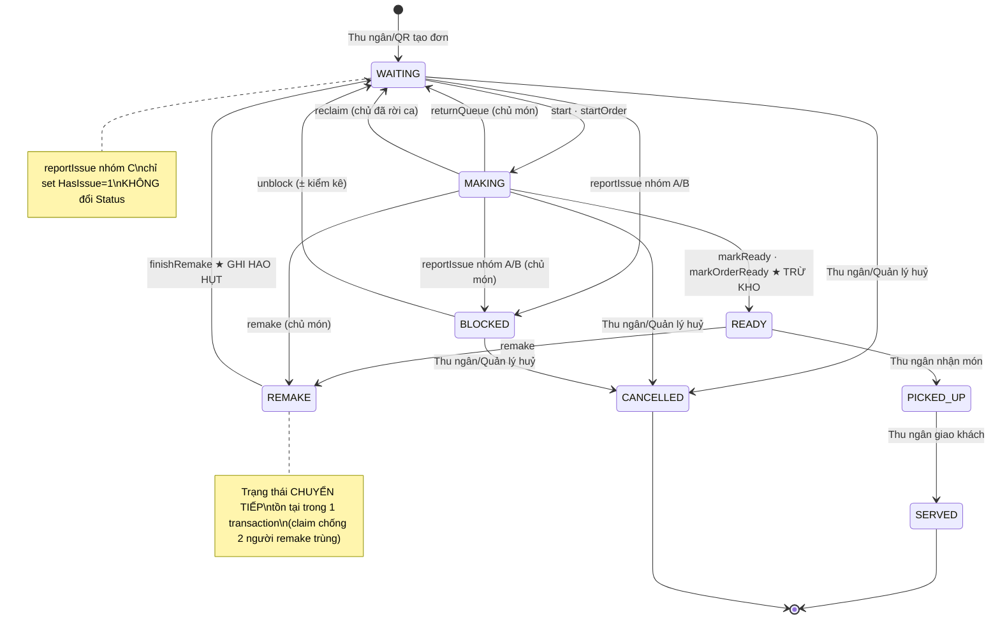

## 5.2 Bảng chuyển trạng thái đầy đủ (guard SQL nguyên văn)

| Action | DAO | `WHERE` guard | Cột ghi thêm |
|---|---|---|---|
| `start` | `claim` | `o.BranchId=? AND o.Status='ACTIVE' AND oi.Status='WAITING'` | `BaristaId=?`, `StartedAt=SYSUTCDATETIME()` |
| `markReady` | `completeClaimed` | `o.BranchId=? AND oi.Status='MAKING' AND oi.BaristaId=?` | `DoneAt`, `PreparedBy`, `HasIssue=0`, `IssueReason=NULL`, `RemakeInventoryReserved=0` |
| `returnQueue` | `returnToQueue` | `o.BranchId=? AND oi.Status='MAKING' AND oi.BaristaId=?` | `BaristaId=NULL`, `StartedAt=NULL` |
| `reclaim` | `reclaim` | `o.BranchId=? AND o.Status='ACTIVE' AND oi.Status='MAKING' AND oi.BaristaId=<expected>` | `BaristaId=NULL`, `StartedAt=NULL` |
| `reportIssue` (C) | `reportIssue` | `o.BranchId=? AND oi.Status IN ('WAITING','MAKING') AND (oi.Status='WAITING' OR oi.BaristaId=?)` | `HasIssue=1`, `IssueReason`, `IssueReportedBy/At` |
| `reportIssue` (A/B) | `blockItem` | như trên **+** `o.Status='ACTIVE'` | `Status='BLOCKED'`, `HasIssue=1`, `BaristaId=NULL`, `StartedAt=NULL` |
| `unblock` | `unblockItem` | `o.BranchId=? AND o.Status='ACTIVE' AND oi.Status='BLOCKED'` | `Status='WAITING'`, xoá sạch 4 cột issue |
| `remake` (từ READY) | `beginRemake` | `o.BranchId=? AND oi.Status='READY'` | `Status='REMAKE'` |
| `remake` (từ MAKING) | `beginRemakeClaimed` | `o.BranchId=? AND oi.Status='MAKING' AND oi.BaristaId=?` | `Status='REMAKE'` |
| *(tiếp)* | `finishRemake` | `o.BranchId=? AND oi.Status='REMAKE'` | `Status='WAITING'`, `Priority=MAX+1`, `RemakeCount+1`, `RemakeInventoryReserved=?`, xoá `BaristaId/PreparedBy/StartedAt/DoneAt/HasIssue/IssueReason` |

**Mọi guard đều là MỘT câu `UPDATE` có điều kiện** → chốt trạng thái **nguyên tử ở tầng DB**.
`affectedRows == 0` ⇒ món đã bị thao tác khác đổi ⇒ trả `false` ⇒ `flashConflict`.

> Đây là hàng rào chống **double-deduct**: chỉ request thắng cuộc "claim" được món (`rows == 1`)
> mới đi tiếp tới bước trừ kho.

## 5.3 Ai được làm gì trên món của ai

| Món đang | Chủ món | Người khác (trong ca) | Người khác (chủ đã rời ca) |
|---|---|---|---|
| `WAITING` | Nhận pha · Báo sự cố | Nhận pha · Báo sự cố | — |
| `MAKING` | Xong · Trả lại chờ · Báo sự cố · Làm lại | *(chỉ xem)* | **Thu hồi món** |
| `READY` | Làm lại | Làm lại | Làm lại |
| `BLOCKED` | Trả về chờ pha | Trả về chờ pha | Trả về chờ pha |

---

# 6. Luồng code chi tiết

## 6.1 Kiến trúc phân tầng

```
JSP / kds-board.js
      ↓  (form POST · fetch)
controller/barista/*Servlet        ← CSRF · allowlist · guard ca · bind tham số
      ↓
web/support/*  (RequestParams · BranchContext · CsrfUtil · SessionUtil · BaristaShiftSupport)
      ↓
service/barista/*  (KdsService · PrepService · WasteService)
      ↓
service/shared/*   (KdsOrderWorkflowService · OrderIssueService · OrderQueryService)
                   (InventoryService → Ledger · Prep · Waste · StockAdjustment · Query)
      ↓
dao/**             ← SQL thuần, không mở transaction
      ↓
config/DBConnection → SQL Server
```

**Ràng buộc kiến trúc do ArchUnit gác**
([MvcArchitectureTest](../src/test/java/com/cafe/architecture/MvcArchitectureTest.java)):

| Luật | Hệ quả thực tế |
|---|---|
| `common/` **không** phụ thuộc `jakarta.servlet..` | Helper đọc request phải nằm ở `web/support/`, **không** ở `common/` |
| `controller/`, `web/` **không** chạm `dao/`, `java.sql..`, `DBConnection` | Servlet không tự mở connection |
| `service/` **không** phụ thuộc `controller/`, `web/` | |
| `model/` độc lập | Không dính servlet/sql |
| Package con của `service/` không có chu trình | |

> 📌 **Không còn facade `OrderService`.** Commit `cf92671` (*"bỏ hẳn facade OrderService, mỗi caller
> giữ đúng service nó cần"*) đã xoá file này. `KdsService` nay giữ **ba** phụ thuộc, phản ánh đúng
> ba việc màn KDS làm:
>
> | Phụ thuộc | Dùng cho |
> |---|---|
> | `OrderQueryService` | `getBaristaWorkbench` · `getRecipeIngredients` · `getDepletedRecipeIngredients` |
> | `KdsOrderWorkflowService` | `startItem` · `markItemReady` · `startAllInOrder` · `markOrderReady` · `returnItemToQueue` · `reclaimItem` |
> | `OrderIssueService` | `reportItemIssue` · `blockItem` · `blockItemForDepletedIngredients` · `unblockItem` · `remakeItem` |
>
> `BaristaShiftSupport` cũng đổi theo: gọi thẳng `KdsOrderWorkflowService.countMyMakingItems`.

## 6.2 Vòng đời một POST ở KDS

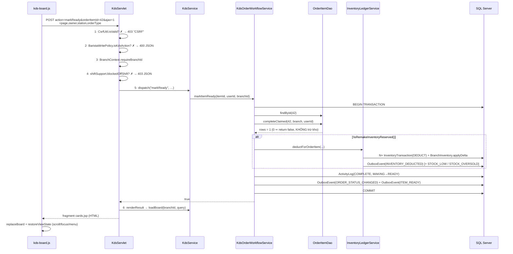

**Xử lý ngoại lệ ở `doPost`** — thứ tự catch **cố ý**:

```java
catch (NumberFormatException e)                          // PHẢI đứng TRƯỚC IllegalArgumentException
    → "Dữ liệu món không hợp lệ. Vui lòng tải lại và thử lại."
catch (IllegalArgumentException | BusinessException e)
    → e.getMessage()                                     // đã là chữ hiển thị được
catch (Exception e)
    → "Không thể cập nhật món lúc này. Vui lòng tải lại và thử lại."
```

> `NumberFormatException` là **lớp con** của `IllegalArgumentException`. Bắt sau thì message máy
> móc kiểu *"For input string: …"* sẽ hiện thẳng lên banner của barista.

Sau đó `renderResult` được gọi ở **MỌI nhánh** (thành công hay lỗi nghiệp vụ) — chỉ một chỗ duy
nhất, thay vì lặp trong từng khối catch.

## 6.3 `markOrderReady` — vì sao phải lọc TRƯỚC vòng lặp

[KdsOrderWorkflowService.markOrderReady:118](../src/main/java/com/cafe/service/shared/KdsOrderWorkflowService.java#L118):

```java
List<OrderItem> items = itemDao.findByOrder(conn, orderId);
Set<Integer> productIds = ...;
Set<Integer> withRecipe = productRecipeDao.findProductIdsWithRecipe(conn, productIds);  // ← 1 query

for (OrderItem it : items) {
    if (!"MAKING".equals(it.getStatus())) continue;
    if (!userId.equals(it.getBaristaId())) continue;              // chỉ món của chính mình
    if (!withRecipe.contains(it.getProductId())) { skipped++; continue; }   // ← LỌC TRƯỚC
    if (completeInTx(conn, it, userId, sessionBranchId)) completed++;
}
return new BulkReadyResult(completed, skipped);
```

> `deductForOrderItem` ném `BusinessException` khi công thức rỗng. Ném **giữa vòng lặp** thì cả đơn
> rollback chỉ vì một dòng — các ly **đã pha xong thật** sẽ quay ngược về "đang pha".

Ba thông báo tương ứng ở Controller:

| `completed` | `skipped` | Thông báo |
|---|---|---|
| 0 | 0 | `flashConflict` |
| ≥ 0 | > 0 | "Đã hoàn thành N món. Còn M món chưa có công thức — hãy bấm Báo sự cố cho từng món đó." |
| > 0 | 0 | "Đã hoàn thành N món của đơn này." |

## 6.4 Trừ kho — `deductForOrderItem`

[InventoryLedgerService:53](../src/main/java/com/cafe/service/shared/InventoryLedgerService.java#L53):

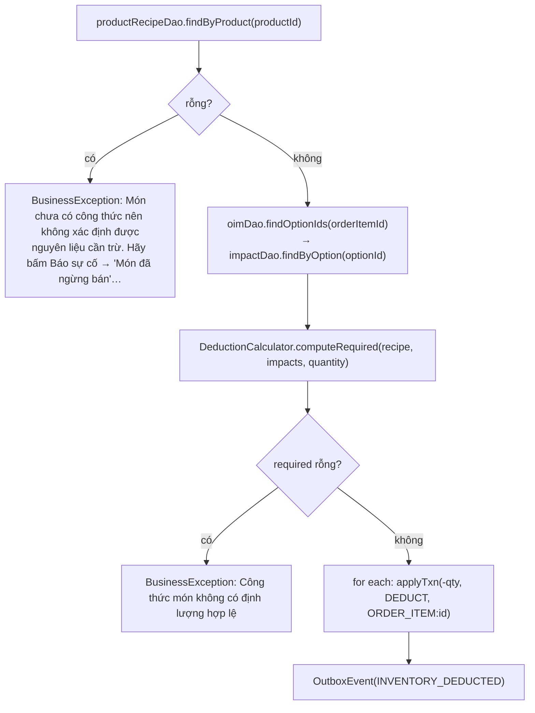

**Công thức** ([DeductionCalculator](../src/main/java/com/cafe/common/DeductionCalculator.java)):

```
perUnit[ing] = Σ recipe[ing].Quantity + Σ modifierImpact[ing].Quantity
required[ing] = perUnit[ing] × OrderItem.Quantity        , chỉ giữ perUnit > 0
```

Hai điểm tinh vi:
- **Không phân nhánh RAW/PREPPED.** Cứ trừ đúng ingredient mà công thức tham chiếu.
  Cold Brew là `PREPPED` → trừ tồn Cold Brew, **KHÔNG** trừ cà phê hạt lần 2 (RAW đã bị trừ ở
  `PrepBatch`). Đây chính là cơ chế chống **double-count**.
- Modifier `Quantity` có thể **âm** (đổi/bớt nguyên liệu); net ≤ 0 thì bỏ qua — **không cộng tồn ngược**.

**`applyTxn` làm 3 việc, luôn theo thứ tự:**
1. Ghi sổ cái `InventoryTransaction` (append-only);
2. Cập nhật cache `BranchInventory.QuantityOnHand`;
3. Cảnh báo tồn — `STOCK_OVERSOLD` (< 0, ưu tiên) **tách riêng** khỏi `STOCK_LOW` (≤ `MinThreshold`).

## 6.5 Quản lý transaction

| Pattern | Dùng ở | Đặc điểm |
|---|---|---|
| `OrderRepository.tx(fn)` | Mọi use case KDS | Rollback cả `SQLException` **và** `RuntimeException`; **tự chạy lại khi là nạn nhân deadlock** |
| `OrderRepository.txVoid(fn)` | | Chỉ là `tx(conn -> { …; return null; })` |
| `try { conn.setAutoCommit(false) … } finally { setAutoCommit(true) }` | Inventory services | Tự quản, cùng nguyên tắc (không có retry) |
| `logWasteInTx` / `blockInTx` / `completeInTx` / `applyBaseAdjustmentInTx` | Hàm `*InTx` | Chạy **TRONG** tx của caller, không tự commit |

### Chạy lại khi bị chọn làm nạn nhân deadlock

```java
for (int attempt = 1; ; attempt++) {
    try (Connection conn = DBConnection.getConnection()) {
        conn.setAutoCommit(false);
        try { T r = fn.run(conn); conn.commit(); return r; }
        catch (SQLException | RuntimeException e) {
            conn.rollback();
            if (attempt >= TX_MAX_ATTEMPTS /* 3 */ || !isDeadlockVictim(e)) throw e;
        }
        finally { conn.setAutoCommit(true); }
    }
    backOff(attempt);   // sleep ngẫu nhiên [10×attempt, 40×attempt) ms
}
```

| Chi tiết | Giá trị |
|---|---|
| Mã lỗi SQL Server | **1205** — *"giao dịch bị chọn làm nạn nhân deadlock"* |
| Số lượt tối đa | 3 |
| Nghỉ giữa các lượt | ngẫu nhiên `[10×attempt, 40×attempt)` ms — lệch nhau để lượt sau không va lại đúng như lượt trước |
| Dò mã lỗi | Duyệt cả chuỗi `getCause()` **và** `getNextException()` |

> **Phải chạy lại từ đầu bằng connection mới**, KHÔNG thử lại trong cùng connection như vòng lặp
> cấp mã pickup ở `OrderDao.insert`: lỗi 1205 **huỷ nguyên giao dịch** chứ không chỉ câu lệnh, nên
> mọi thao tác đã ghi trước đó cũng mất theo. Vòng lặp cũ chỉ bắt trùng khoá (2601/2627) — lỗi
> **cấp câu lệnh**, giao dịch còn sống nên thử lại tại chỗ mới hợp lệ.
>
> Chạy lại an toàn vì mọi `fn` đều dựng lại trạng thái của nó **bên trong** lambda và `rollback` đã
> xoá sạch phần ghi dở. Đường sinh deadlock đã biết: cấp mã pickup quét dải `SELECT MAX(...)` lấy
> khoá S rồi `INSERT` nâng lên X.

> ⚠️ **Bẫy JDBC đã từng gây bug thật** — ghi nguyên văn trong
> [OrderRepository:96](../src/main/java/com/cafe/service/shared/OrderRepository.java#L96):
>
> `BusinessException`/`IllegalArgumentException` là `RuntimeException` nên **PHẢI** rollback cùng
> chỗ với `SQLException`. Bỏ sót thì `setAutoCommit(true)` ở `finally` **lại commit phần đã ghi dở**
> (hợp đồng JDBC: đổi auto-commit mode giữa transaction sẽ commit transaction đó).
> Trước đây món chưa có công thức vẫn sang `READY` rồi mới ném lỗi ở bước trừ kho →
> **READY mà không trừ kho**.

## 6.6 Sequence: Báo sự cố nhóm A (hết nguyên liệu)

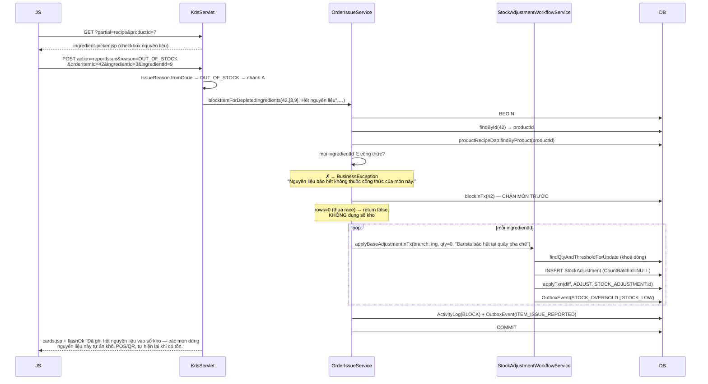

## 6.7 Sequence: Tạo mẻ pha sẵn

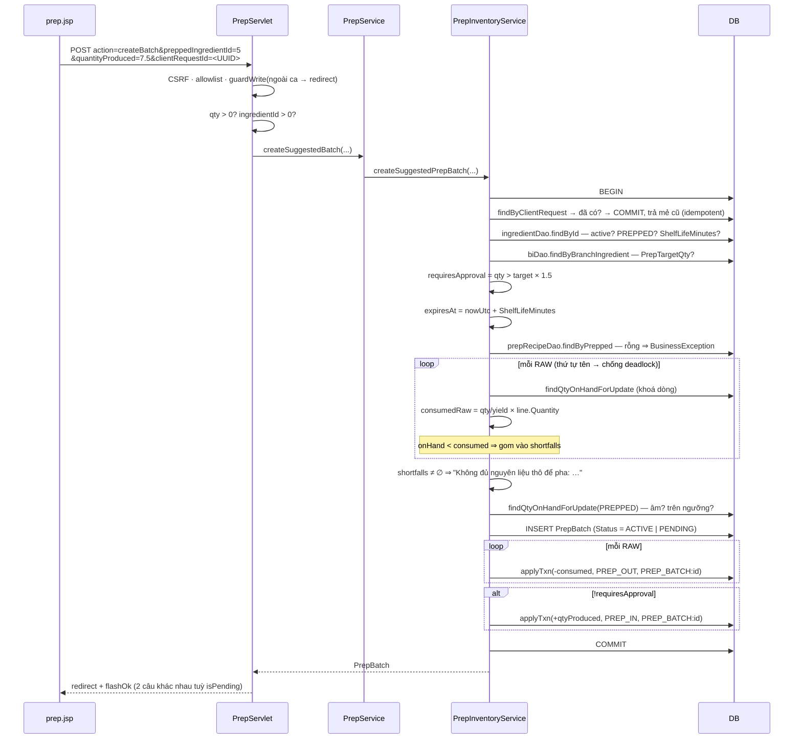

## 6.8 Sequence: Ghi hao hụt nhiều dòng

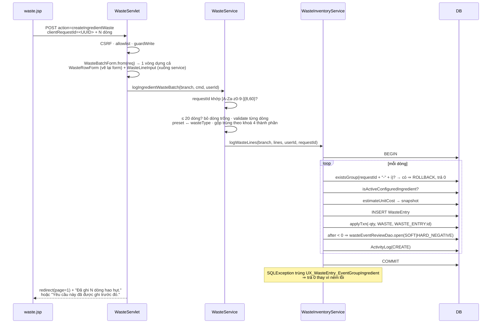

## 6.9 Helper dùng chung

[RequestParams.java](../src/main/java/com/cafe/web/support/RequestParams.java) — bản sao **duy nhất**
trong toàn repo (trước đây có 5 bản):

| Method | Hành vi |
|---|---|
| `text(req, name, maxLength)` | trim, cắt độ dài |
| `positiveInt(req, name, fallback)` | không phải số / < 1 → `fallback` |
| `optionalInt(req, name)` | trả `null` thay vì ném |
| `allowed(req, name, values…)` | không thuộc allowlist → `""` |
| `isBlank(value)` | |

> `normalizePageSize` **KHÔNG gom được** — mỗi màn có bộ giá trị riêng:
> Waste `{5,10,20,50}`/5 · MyShift `{5,10,20,50}`/10 · EightySix `{10,20,50}`/10.
> Ép chung là đổi hành vi.

---

# 7. Quy tắc sổ cái kho

## 7.1 Bốn bất biến (Contract)

| # | Bất biến | Thực thi ở |
|---|---|---|
| **1** | Trừ kho **có nhận biết modifier**, chỉ xảy ra tại `markReady` | `InventoryLedgerService.deductForOrderItem` |
| **2** | RAW → PREPPED **chỉ** qua `PrepBatch`; PREPPED không trừ RAW lần 2 | `PrepInventoryService.doCreatePrepBatch` + `DeductionCalculator` không phân nhánh |
| **4** | Sửa/huỷ = **txn bù**, KHÔNG hard-delete, KHÔNG UPDATE thẳng tồn | `updateWaste` · `voidWaste` · `cancelPrepBatch` · `releaseRemakeReservation` |
| — | Mọi thay đổi tồn phải có dòng đối ứng trong `InventoryTransaction` | `applyTxn` là **cửa duy nhất** |

## 7.2 Quy tắc "đọc lại sổ, không tính lại công thức"

Áp dụng cho **mọi** thao tác đảo ngược:

```java
Map<Integer,BigDecimal> applied =
    txnDao.sumByRef(conn, branchId, InventoryReferenceType.PREP_BATCH, prepBatchId, "PREP_OUT");
```

Lý do (ghi trong [PrepInventoryService:200](../src/main/java/com/cafe/service/shared/PrepInventoryService.java#L200)):

> Định mức có thể đã đổi từ lúc pha, và số đã ghi bị làm tròn về `DECIMAL(12,3)`. Đọc lại sổ nên
> ledger **nets về đúng 0** theo từng type.

Chỉ khi sổ cái trống (dữ liệu cũ có trước khi ledger được ghi đầy đủ) mới rơi vào nhánh dự phòng
tính lại theo công thức.

## 7.3 Bảng đối chiếu: thao tác → dòng ledger

| Thao tác Barista | `TxnType` | Dấu | `ReferenceType` | Bảng chứng từ |
|---|---|---|---|---|
| `markReady` | `DEDUCT` | − | `ORDER_ITEM` | — |
| Tạo mẻ (RAW) | `PREP_OUT` | − | `PREP_BATCH` | `PrepBatch` |
| Tạo mẻ ACTIVE (PREPPED) | `PREP_IN` | + | `PREP_BATCH` | `PrepBatch` |
| Quản lý duyệt mẻ PENDING | `PREP_IN` | + | `PREP_BATCH` | `PrepBatch` |
| Quản lý từ chối mẻ | `PREP_OUT` | **+** (đảo) | `PREP_BATCH` | `PrepBatch` |
| Ghi hao hụt | `WASTE` | − | `WASTE_ENTRY` | `WasteEntry` |
| Sửa hao hụt (tăng) | `WASTE` | − delta | `WASTE_ENTRY` | `WasteEntry` |
| Sửa hao hụt (giảm) | `WASTE` | **+** delta | `WASTE_ENTRY` | `WasteEntry` |
| Huỷ hao hụt | `WASTE` | **+** qty | `WASTE_ENTRY` | `WasteEntry` |
| `remake` | `WASTE` | − | `WASTE_ENTRY` | `WasteEntry` (kind=`REMAKE`) |
| Huỷ món đang giữ chỗ remake | `WASTE` | **+** qty | `WASTE_ENTRY` | `WasteEntry` → `VOIDED` |
| Write-off mẻ quá hạn | `WASTE` | − | `WASTE_ENTRY` | `WasteEntry` + `PrepBatch.WriteOffWasteEntryId` |
| Báo hết nguyên liệu | `ADJUST` | ± diff | `STOCK_ADJUSTMENT` | `StockAdjustment` |
| Kiểm kê nhanh khi bỏ chặn | `ADJUST` | ± diff | `STOCK_ADJUSTMENT` | `StockAdjustment` |

## 7.4 `releaseRemakeReservation` — chống ghi thừa một lượt

Món bị **huỷ** trong lúc `RemakeInventoryReserved = 1`: lượt pha đó sẽ **không bao giờ xảy ra**,
nên dòng WASTE giữ chỗ phải hoàn về kho — bỏ qua thì sổ ghi **thừa đúng một lượt**.

```java
for (WasteEventItem line : findActiveRemakeLinesOfLatestEvent(conn, branchId, orderItemId)) {
    // Đánh dấu VOIDED TRƯỚC rồi mới hoàn kho: câu UPDATE có điều kiện Status='ACTIVE'
    // là chốt nguyên tử ⇒ hai lần huỷ song song chỉ cộng lại tồn MỘT lần.
    if (updateStatusForBranch(line.getWasteEntryId(), branchId, "VOIDED") != 1) continue;
    int performedBy = userId == null ? line.getLoggedBy() : userId;   // khách QR tự huỷ ⇒ không có userId
    applyTxn(+line.getQuantity(), WASTE, WASTE_ENTRY:id, performedBy);
}
```

---

# 8. Bảo mật & các lớp guard

Mỗi POST của Barista đi qua **7 lớp**:

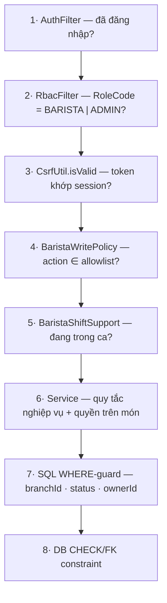

## 8.1 Chi tiết từng lớp

| Lớp | Chặn được gì | Trả về |
|---|---|---|
| 1 AuthFilter | Chưa đăng nhập | redirect login |
| 2 RbacFilter | Nhân viên role khác gõ URL `/barista/*` | **403** |
| 3 CSRF | Form giả từ site khác | `403 "CSRF"` |
| 4 Allowlist | POST tự soạn / typo action | flash + (AJAX) `400` + header |
| 5 Guard ca | Thao tác ngoài ca | flash + (AJAX) `403` + header |
| 6 Service | Nguyên liệu ngoài công thức · chủ món còn trực · quá 15 phút · mẻ chưa quá hạn… | `BusinessException` → flash |
| 7 SQL guard | Chi nhánh khác · trạng thái đã đổi · không phải chủ món | `rows = 0` → flash conflict |
| 8 DB constraint | Dữ liệu vi phạm bất biến | `SQLException` → thông báo chung |

## 8.2 Chống XSS

| Vị trí | Kỹ thuật |
|---|---|
| Mọi giá trị người dùng trong JSP | `<c:out value="${…}" />` |
| JSON nhúng `<script>` (`prep.jsp`) | `PrepService.esc()` — escape thêm `< > & '` → `\uXXXX` |
| Chip ghi chú 86 | `Reason86.getQuickNotesJson()` — escape `" \ \b \f \n \r \t` |
| Bộ lọc ghép vào URL pager | Đã qua whitelist ở servlet ⇒ ghép thẳng là an toàn |
| Lý do nhúng vào JSON outbox | `OrderIssueService.sanitizeReason` — xoá `\ " ` + ký tự điều khiển, cắt 120 ký tự |

## 8.3 Chống chèn dữ liệu qua POST tự soạn

Ba chốt đáng chú ý (đều **không** thể hiện trên UI, chỉ có ở server):

1. **Nguyên liệu báo hết phải thuộc công thức món** — nếu không, ép được tồn của bất kỳ nguyên liệu
   nào ở chi nhánh về 0 → mọi món dùng nó biến mất khỏi POS/QR.
2. **Nguyên liệu kiểm kê khi bỏ chặn cũng vậy** — đối xứng với chốt trên.
3. **Lượng write-off mẻ quá hạn lấy từ hệ thống, không nhận từ client** — barista chỉ bấm xác nhận,
   không có đường ghi khống.

---

# 9. Bẫy và điểm dễ sai

| # | Bẫy | Hệ quả nếu làm sai | Chốt hiện tại |
|---|---|---|---|
| 1 | Bắt `IllegalArgumentException` trước `NumberFormatException` | Message *"For input string: …"* hiện lên banner barista | Thứ tự catch ở `KdsServlet.doPost` |
| 2 | Không rollback `RuntimeException` trong tx | `setAutoCommit(true)` ở `finally` **commit phần đã ghi dở** → READY mà không trừ kho | `OrderRepository.tx/txVoid` bắt `SQLException \| RuntimeException` |
| 3 | Bật `RemakeInventoryReserved` vô điều kiện | Làm lại từ `MAKING` **trừ thiếu đúng một lượt** | `RemakeReservation.reservesNextPour` |
| 4 | Ném lỗi giữa vòng lặp `markOrderReady` | Cả đơn rollback, ly đã pha xong quay về "đang pha" | Lọc `withRecipe` **trước** vòng lặp |
| 5 | Mỗi mẻ quá hạn tự lấy `min(sản lượng, tồn)` | Tổng gợi ý vượt tồn thực → **âm kho** | `ExpiryWasteCalculator` phân bổ FIFO trên quỹ chung |
| 6 | Tính lại theo công thức khi đảo ngược | Định mức đã đổi / làm tròn → ledger **không nets về 0** | `sumByRef` đọc lại chính sổ cái |
| 7 | Đếm `orderLineNo` **sau** khi lọc | Nhãn "món 2/3" đổi nghĩa mỗi lần bấm chip lọc | `annotateOrderLines` chạy trên hàng chờ đầy đủ |
| 8 | Cắt trang không theo khối đơn | Pha hết trang 1, đơn còn 2 ly ở trang 2 → **giao thiếu** | `QueuePage.splitPages` |
| 9 | Để bộ lọc ẩn món `BLOCKED` | Cảnh báo an toàn bị giấu | `filterWorkbench` luôn giữ `BLOCKED` |
| 10 | Cắt nhật ký hao hụt theo nửa đêm lịch | Ca đêm bị đứt đôi lúc 00:00 | `WasteScope.businessDay(openTime)` |
| 11 | Đếm `BLOCKED` vào cổng tan ca | Khoá barista bằng thứ chính họ không gỡ được | `countMakingByBarista` chỉ đếm `MAKING` |
| 12 | Dùng `form.action` trong JS | Control `<input name="action">` che thuộc tính → URL `"[object HTMLInputElement]"` | `form.getAttribute('action')` |
| 13 | Nhúng danh sách nguyên liệu vào mọi card | 60 card × N nguyên liệu → phình DOM lúc đông khách | Nạp theo yêu cầu qua `?partial=recipe` |
| 14 | Thay `PrepService.esc()` bằng Jackson | Tên nguyên liệu chứa `</script>` đóng sớm thẻ → **XSS** | Giữ `esc()` tự viết |
| 15 | Chuyển `KdsBoardData` sang `record` | EL 4.0 (Jakarta EE 9) chưa đọc được accessor record → gãy toàn bộ `${board.waitingCount}` | Giữ class thường, ghi lý do vào javadoc |
| 16 | Dùng chung tên `wasteType` cho form ghi và bộ lọc nhật ký | Form gửi nhiều giá trị → nhật ký tự lọc sai | Bộ lọc dùng `logType` |
| 17 | Sửa nhãn tiếng Việt trong `IssueReason`/`RemakeReason`/`Reason86` | Đổi **dữ liệu lịch sử** đã ghi vào DB | `ReasonLabelLockTest` |
| 18 | Cho `clockIn` ở màn vận hành | Vào ca mất ngữ cảnh "đã được xếp ca" | `BaristaWritePolicy.isShiftAction` |
| 19 | `UPDATE BranchInventory.QuantityOnHand` bằng SSMS | Lệch sổ cái, không truy vết được | Chỉ qua `applyTxn`; `CriticalIntegrityIT` bắt |
| 20 | Khoá RAW/PREPPED khác thứ tự giữa các thao tác | **Deadlock chéo** | Luôn RAW (theo tên) → PREPPED |
| 21 | Thử lại nạn nhân deadlock (1205) **trong cùng** connection | 1205 huỷ nguyên giao dịch ⇒ phần ghi trước đó mất theo, retry tại chỗ ghi tiếp lên giao dịch đã chết | `OrderRepository.tx` mở connection mới, chạy lại từ đầu, tối đa 3 lượt |
| 22 | `voidOrder` chỉ huỷ món `WAITING` | Đơn về `CANCELLED` mà món vẫn `BLOCKED` — **món mồ côi** còn hiện trên bảng quầy, không có đường thoát | Vòng huỷ nhận cả `WAITING` **và** `BLOCKED` |

---

# 10. Bảng tra cứu file

## 10.1 Controller (6 file)

| File | Dòng | Vai trò |
|---|---|---|
| [KdsServlet.java](../src/main/java/com/cafe/controller/barista/KdsServlet.java) | 328 | Quầy pha chế — 9 action + 3 partial |
| [WasteServlet.java](../src/main/java/com/cafe/controller/barista/WasteServlet.java) | 294 | Hao hụt nguyên liệu |
| [RecipeLookupServlet.java](../src/main/java/com/cafe/controller/barista/RecipeLookupServlet.java) | 159 | Tra cứu công thức (read-only) |
| [EightySixServlet.java](../src/main/java/com/cafe/controller/barista/EightySixServlet.java) | 140 | Báo hết món |
| [PrepServlet.java](../src/main/java/com/cafe/controller/barista/PrepServlet.java) | 126 | Pha sẵn |
| [MyShiftServlet.java](../src/main/java/com/cafe/controller/barista/MyShiftServlet.java) | 109 | Ca làm của tôi |

## 10.2 Service riêng của role (5 file)

| File | Dòng | Vai trò |
|---|---|---|
| [KdsService.java](../src/main/java/com/cafe/service/barista/KdsService.java) | 360 | Dựng board + uỷ thác 3 service tầng đơn |
| [WasteService.java](../src/main/java/com/cafe/service/barista/WasteService.java) | 268 | Validate batch, `WasteScope`, cửa sổ sửa |
| [PrepService.java](../src/main/java/com/cafe/service/barista/PrepService.java) | 139 | Checklist, JSON preview, write-off |
| [KdsBoardData.java](../src/main/java/com/cafe/service/barista/KdsBoardData.java) | 62 | View model của board |
| [QueuePage.java](../src/main/java/com/cafe/service/barista/QueuePage.java) | 82 | Cắt trang theo khối đơn |

## 10.3 Service dùng chung Barista phụ thuộc

| File | Barista dùng để |
|---|---|
| [KdsOrderWorkflowService](../src/main/java/com/cafe/service/shared/KdsOrderWorkflowService.java) | start · markReady · startAllInOrder · markOrderReady · reclaim · returnToQueue · countMyMakingItems |
| [OrderIssueService](../src/main/java/com/cafe/service/shared/OrderIssueService.java) | reportIssue · blockItem · blockItemForDepletedIngredients · unblock · remake |
| [OrderQueryService](../src/main/java/com/cafe/service/shared/OrderQueryService.java) | getBaristaWorkbench (+ `recipeMissing`, modifiers) · getRecipeIngredients · getDepletedRecipeIngredients |
| [OrderRepository](../src/main/java/com/cafe/service/shared/OrderRepository.java) | *(package-private)* gom DAO + `tx()` có retry deadlock |
| [InventoryService](../src/main/java/com/cafe/service/shared/InventoryService.java) | Facade kho |
| [InventoryLedgerService](../src/main/java/com/cafe/service/shared/InventoryLedgerService.java) | `applyTxn` · `deductForOrderItem` |
| [PrepInventoryService](../src/main/java/com/cafe/service/shared/PrepInventoryService.java) | createSuggestedPrepBatch · writeOffExpiredPrepBatch |
| [WasteInventoryService](../src/main/java/com/cafe/service/shared/WasteInventoryService.java) | logWasteLines · updateWaste · voidWaste · reserveRemake · releaseRemake |
| [StockAdjustmentWorkflowService](../src/main/java/com/cafe/service/shared/StockAdjustmentWorkflowService.java) | `applyBaseAdjustmentInTx` |
| [BranchMenuService](../src/main/java/com/cafe/service/shared/BranchMenuService.java) | request86 · requestReopen · getSuggested86 |
| [AttendanceService](../src/main/java/com/cafe/service/manager/AttendanceService.java) | clockIn/Out · getMyShiftStatus · **getOnDutyUserIds** |
| [CatalogReadService](../src/main/java/com/cafe/service/shared/CatalogReadService.java) | Tra cứu công thức |

## 10.4 Logic thuần trong `common/` (unit-test được, không cần DB)

| File | Nội dung |
|---|---|
| [DeductionCalculator](../src/main/java/com/cafe/common/DeductionCalculator.java) | Công thức trừ kho có modifier |
| [PrepConsumptionCalculator](../src/main/java/com/cafe/common/PrepConsumptionCalculator.java) | `qty/yield × lineQty` |
| [PrepApprovalPolicy](../src/main/java/com/cafe/common/PrepApprovalPolicy.java) | Ngưỡng `× 1.5` |
| [RemakeReservation](../src/main/java/com/cafe/common/RemakeReservation.java) | `fromReady \|\| alreadyReserved` |
| [ExpiryWasteCalculator](../src/main/java/com/cafe/common/ExpiryWasteCalculator.java) | Phân bổ FIFO lượng hao hụt gợi ý |
| [RecountValidator](../src/main/java/com/cafe/common/RecountValidator.java) | Parse form kiểm kê nhanh |
| [Menu86Validator](../src/main/java/com/cafe/common/Menu86Validator.java) | Validate form báo 86 |
| [BusinessDay](../src/main/java/com/cafe/common/BusinessDay.java) | Mốc ngày kinh doanh + format VN |
| [ShiftWindow](../src/main/java/com/cafe/common/ShiftWindow.java) | `isClockable` · `onDuty` |
| [IssueReason](../src/main/java/com/cafe/common/IssueReason.java) · [RemakeReason](../src/main/java/com/cafe/common/RemakeReason.java) · [Reason86](../src/main/java/com/cafe/common/Reason86.java) | Enum lý do + nhãn |
| [OrderItemStatus](../src/main/java/com/cafe/common/OrderItemStatus.java) | 8 trạng thái + nhãn VN |

## 10.5 View & asset

| File | Dòng |
|---|---|
| `views/barista/waste.jsp` | 505 |
| `views/barista/recipe.jsp` | 452 |
| `views/barista/eightysix.jsp` | 261 |
| `views/barista/prep.jsp` | 257 |
| `views/barista/shift.jsp` | 240 |
| `views/barista/kds.jsp` | 122 |
| `fragments/barista/kds/queue-row.jsp` | 203 |
| `fragments/barista/kds/cards.jsp` | 130 |
| `fragments/barista/kds/recount-picker.jsp` | 24 |
| `fragments/barista/kds/ingredient-picker.jsp` | 21 |
| `assets/js/barista/kds-board.js` | 582 |

## 10.6 Tham số & hằng số

| Hằng | Giá trị | Ở đâu |
|---|---|---|
| `QUEUE_PAGE_SIZE` | 12 | `KdsService` |
| `PEAK_THRESHOLD_CUPS` | 12 | `Constants` (chi nhánh ghi đè bằng `Branch.PeakThresholdCups`) |
| `KDS_WARN_SECONDS` / `KDS_CRIT_SECONDS` | 480 / 720 | `Constants` |
| `PICKUP_WARN_SECONDS` / `PICKUP_CRIT_SECONDS` | 180 / 360 | `Constants` |
| `MENU86_NOTE_MAX_CHARS` | 255 | `Constants` |
| `MENU86_OTHER_NOTE_MIN_CHARS` | 10 | `Constants` |
| `MENU86_ETA_MIN_MINUTES` / `MENU86_ETA_MAX_DAYS` | 15 / 7 | `Constants` |
| `MAX_WASTE_ROWS` | 20 | `WasteService` |
| Cửa sổ sửa hao hụt | 15 phút | `WasteService` |
| `THRESHOLD_MULTIPLIER` | 1.5 | `PrepApprovalPolicy` |
| `MAX_WASTE_QUANTITY` | 999 999 999.999 | `WasteInventoryService` |
| `PAGE_SIZE` (tra cứu công thức) | 5 | `RecipeLookupServlet` |
| `LATE_CLOCK_OUT_LOOKBACK` | 2 ngày | `AttendanceService` |
| `suppressUntil` sau POST | 1800 ms | `kds-board.js` |
| Session timeout | 30 phút | `web.xml` |

---

# 11. Test đang phủ những gì

## 11.1 Unit test

| Nhóm | File |
|---|---|
| KDS | `KdsOrderGroupTest` · `KdsPeakTest` · `KdsQueuePageTest` · `KdsWorkbenchSplitTest` |
| Waste | `WasteScopeTest` · `WasteSummaryTest` · `WasteLogPagingTest` · `WasteServletValidationTest` |
| Controller | `BaristaWritePolicyTest` · `EightySixServletFilterTest` · `MyShiftHistoryPagingTest` |
| Model | `BaristaWorkbenchItemTest` · `PrepChecklistRowTest` · `PrepRecipeDisplayTest` · `ProductStockStatusTest` · `BranchMenuItemEtaTest` |
| Logic thuần | `DeductionCalculatorTest` · `PrepConsumptionCalculatorTest` · `PrepApprovalPolicyTest` · `RemakeReservationTest` · `ExpiryWasteCalculatorTest` · `RecountValidatorTest` · `Menu86ValidatorTest` · `ReasonLabelLockTest` |
| Ca làm | `ShiftWindowTest` · `ShiftHoursTest` · `ShiftConflictTest` · `ShiftDutyTest` · `ShiftAssignmentGraceTest` |
| Ngày kinh doanh | `BusinessDayTest` · `BusinessDayVnFormatTest` · `BusinessDayVnRangeTest` |
| Kiến trúc | `MvcArchitectureTest` · `WebSourceContractTest` |

## 11.2 Integration test (cần SQL Server)

| File | Phủ |
|---|---|
| `BaristaTransactionIT` | Transaction của luồng pha chế |
| `BaristaIssueWorkflowIT` | Báo sự cố → chặn → bỏ chặn + kiểm kê |
| `CriticalIntegrityIT` | Ledger vs cache tồn |
| `DatabaseSchemaContractIT` · `DatabaseNormalizationIT` · `DatabaseMigrationIT` | Schema đúng như khai báo |
| `MigrationChecksumTest` | `sql/migration-checksums.sha256` khớp `V1__database.sql` |

## 11.3 Chạy

```bash
mvn -q test              # unit test
mvn -q clean package     # build WAR
```

> Integration test cần SQL Server. Xem [SETUP.md](../SETUP.md) và
> [docs/DATABASE-SETUP.md](./DATABASE-SETUP.md) — lưu ý cổng SQL Server cục bộ có thể lệch với
> `src/main/resources/db.properties`.

---

# 12. Từ điển thuật ngữ

Tên tiếng Anh trong code là **jargon ngành F&B**, không phải đặt bừa:

| Thuật ngữ | Nghĩa | Xuất hiện ở |
|---|---|---|
| **KDS** | *Kitchen Display System* — màn hình bếp | `KdsServlet`, `KdsService`, `kds-board.js` |
| **86** | Tiếng lóng nhà hàng: "hết món, ngưng bán" | `EightySixServlet`, `Reason86`, `Menu86Validator` |
| **86 (soft)** | 86 **tự sinh** do hết nguyên liệu, chỉ gợi ý — không tự khoá | `getSuggested86` |
| **86 (hard)** | Barista khoá tay vì sự cố, Quản lý gác mở lại | `request86` |
| **Workbench** | Bàn thao tác của barista = hàng chờ pha | `getBaristaWorkbench`, `splitWorkbench` |
| **Claim** | "Nhận" món — `WAITING → MAKING`, ghi `BaristaId` trong cùng câu UPDATE để khoá | `OrderItemDao.claim` |
| **Prep / PREPPED** | Nguyên liệu pha sẵn (đối lập `RAW`) | `PrepService`, `PrepBatch` |
| **Yield** | Sản lượng một mẻ chuẩn (`Ingredient.PrepYieldQty`) | `PrepConsumptionCalculator` |
| **Ledger / txn bù** | Sổ cái kho — sửa/huỷ ghi giao dịch **đối ứng**, không xoá cứng | `InventoryTransaction` |
| **Business day** | Ngày kinh doanh, cắt theo **giờ mở cửa** chi nhánh chứ không phải nửa đêm | `BusinessDay`, `WasteScope` |
| **Stale item** | Món dang dở còn sót từ ngày kinh doanh trước | `findStaleItems` |
| **Peak mode** | Cao điểm — số ly chờ+đang pha chạm ngưỡng chi nhánh | `KdsService.isPeak` |
| **Reserve (remake)** | "Giữ chỗ" nguyên liệu cho lượt pha kế tiếp | `RemakeInventoryReserved` |
| **Write-off** | Ghi hao hụt + đóng vòng đời mẻ quá hạn trong một transaction | `writeOffExpiredPrepBatch` |
| **Recount** | Kiểm kê nhanh ngay tại quầy (không tạo phiên kiểm kê) | `RecountValidator`, `CountBatchId = NULL` |
| **Outbox** | Bảng sự kiện chờ đồng bộ — ghi cùng transaction nghiệp vụ | `ops.OutboxEvent` |
| **Group start / grouped** | Đơn có ≥ 2 dòng **liền nhau** trên danh sách đang hiện → dựng tiêu đề nhóm | `markGroupStarts` |
| **Off duty** | Chủ món đã rời ca → mở nút "Thu hồi món" | `ownerOffDuty`, `getOnDutyUserIds` |

---

## Tài liệu liên quan

| File | Nội dung |
|---|---|
| [docs/PHAN_CUM_NGHIEP_VU_DATABASE.md](./PHAN_CUM_NGHIEP_VU_DATABASE.md) | Toàn bộ 25 bảng theo 8 cụm nghiệp vụ |
| [docs/KE_HOACH_CLEAN_CODE_BARISTA.md](./KE_HOACH_CLEAN_CODE_BARISTA.md) | Nhật ký refactor role Barista (5 đợt, đã xong) |
| [docs/HAPPY_CASE_MAIN_FLOWS.md](./HAPPY_CASE_MAIN_FLOWS.md) | 4 luồng chính end-to-end |
| [docs/RA_SOAT_DATABASE.md](./RA_SOAT_DATABASE.md) | Rà soát schema |
| [sql/ssms/README.md](../sql/ssms/README.md) | Truy vấn quan sát trong SSMS |
| [KE_HOACH_CHI_TIET_THEO_ROLE.md](../KE_HOACH_CHI_TIET_THEO_ROLE.md) | Kế hoạch tổng theo từng role |
